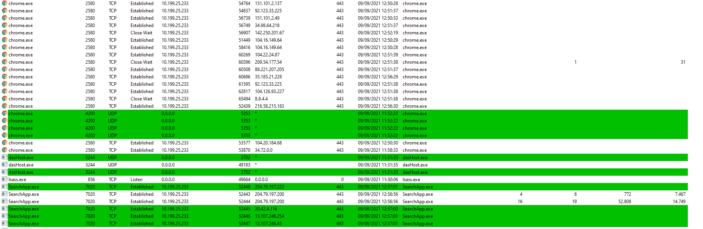

# Que es Isass? Y donde esta ubicado?

<!--  -->

Iass.exe es un proceso legítimo de Windows conocido como Servicio de Autoridad de Seguridad Local. Originalmente, el archivo lsass.exe se localiza en la carpeta <b>“C:\WINDOWS\SYSTEM32\»</b> y no puede ser finalizado ni visualizado desde el Administrador de Tareas. Si acabas con esta tarea, esto puede conducirte a tener varios problemas relacionados con el ordenador y la sesión.
	

Se puede apreciar los diferentes servicios y procesos que se ejecutan entre ellos Chrome.