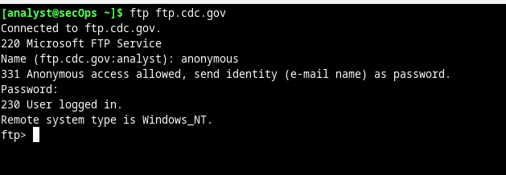
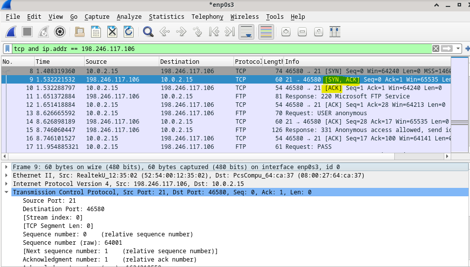
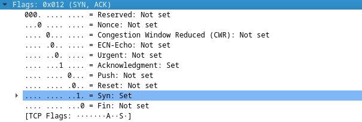
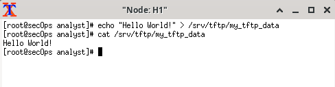

# Utilizar Wireshark para examinar capturas de TCP y UDP

Dos de los protocolos de la capa de transporte de TCP/IP son TCP (definido en RFC 761) y UDP (definido en RFC 768). Los dos protocolos admiten la comunicación de protocolos de capa superior. Por ejemplo, TCP se utiliza para proporcionar soporte de capa de transporte para el protocolo de transferencia de hipertexto (HTTP) y FTP, entre otros. UDP proporciona soporte de capa de transporte para el sistema de nombres de dominio (DNS) y TFTP, entre otros.

En la Parte 1 de esta práctica de laboratorio utilizarán la herramienta de código abierto Wireshark para capturar y analizar campos de encabezado del protocolo TCP para las transferencias de archivos FTP entre el equipo host y un servidor FTP anónimo. Se utiliza la línea de comandos del terminal para establecer una conexión a un servidor FTP anónimo y descargar un archivo. En la Parte 2 de esta práctica de laboratorio, utilizará Wireshark para capturar y analizar campos de encabezado UDP correspondientes a transferencias de archivos TFTP entre computadoras host de Mininet.

Haremos una llamada ftp a una pagina para probar:

- Usando Wireshark podemos ver el trafico que se ha generado:

En Wireshark, se encuentra disponible información detallada sobre TCP en el panel de detalles del paquete (sección media). Resalte los primeros datagramas TCP del host, y expanda las porciones del datagrama de TCP, como se muestra a continuación.  

El número de puerto de origen TCP pertenece al host de la sesión TCP que abrió una conexión. Generalmente el valor es un valor aleatorio superior a 1.023.

El número de puerto de destino TCP se utiliza para identificar el protocolo de capa superior o la aplicación en el sitio remoto. Los valores en el intervalo de 0 a 1023 representan los “puertos bien conocidos” y están asociados a servicios y aplicaciones populares (como se describe en la RFC 1700), por ejemplo, Telnet, FTP y HTTP. La combinación de la dirección IP de origen, el puerto de origen, la dirección IP de destino y el puerto de destino identifica de manera exclusiva la sesión para el remitente y para el destinatario.

- Podemos ver la IP de salida y el puerto (10.0.2.15:4658)
- Podemos ver la IP target el puerto (198.246.117.106:21)

En la segunda captura filtrada de Wireshark, el servidor FTP de CDC confirma que recibió la solicitud de la VM. Observe los valores de los bits de SYN y ACK.

En la etapa final de la negociación para establecer las comunicaciones, la VM envía un mensaje de acuse de recibo al servidor. Observen que solo el bit ACK está definido en 1, y que el número de secuencia se incrementó a 1.

``El primer paquete enviado por el host al comienzo de una sesión TCP era el unico datagrama que contenia un bit SYN.``

Cuando termina la sesión FTP, el cliente FTP envía un comando para “salir”. El servidor FTP reconoce la terminación de FTP con un mensaje Response: 221 Goodbye (Adiós). En este momento, la sesión TCP del servidor FTP envía un datagrama TCP al cliente FTP que anuncia la terminación de la sesión TCP. La sesión TCP del cliente FTP reconoce la recepción del datagrama de terminación y luego envía su propia terminación de sesión TCP. Cuando quien originó la terminación TCP (servidor FTP) recibe una terminación duplicada, se envía un datagrama ACK para reconocer la terminación y se cierra la sesión TCP. Esta secuencia es visible en la captura y el diagrama siguientes.

Creamos un archivo con un texto dentro:

- Inicie una sesión de tftp de H2 al servidor tftp en H1 y obtengan el archivo my_tftp_data

El panel de detalles de paquetes de Wireshark muestra información detallada sobre UDP. Resalte el primer datagrama UDP del equipo host y mueva el puntero del mouse al panel de detalles de paquetes. Puede ser necesario ajustar el panel de detalles del paquete y expandir el registro UDP haciendo clic en la casilla de expansión de protocolo. El datagrama UDP expandido debe ser similar al siguiente diagrama.

Se envía una checksum en el datagrama UDP y el valor de la checksum del datagrama se vuelve a calcular al recibirlo. Si el valor de checksum calculado es idéntico al valor de checksum enviado, se supone que el datagrama UDP está completo.
TCP administra la comunicación de manera muy diferente a UDP, porque la confiabilidad y garantía ofrecidas requieren un control adicional sobre el canal de comunicación. UDP tiene menos sobrecarga y control, y el protocolo de capa superior debe proveer algún tipo de control de reconocimiento. Ambos protocolos, sin embargo, transportar datos entre clientes y servidores usando protocolos de la capa de aplicación y que son apropiados para el protocolo de capa superior que cada uno admite.