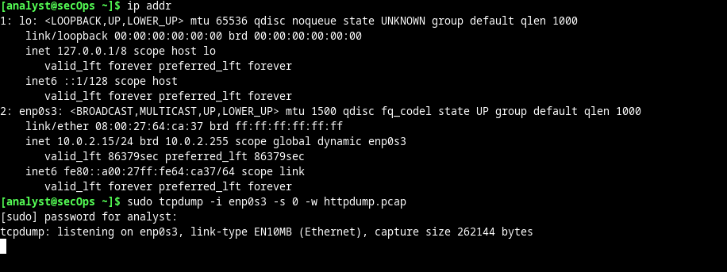
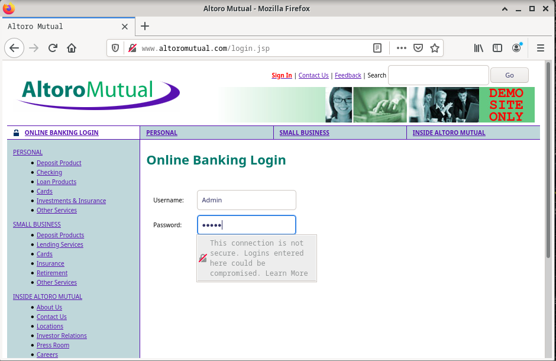
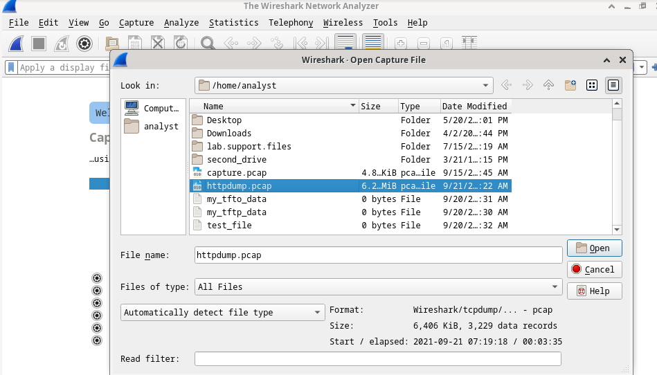
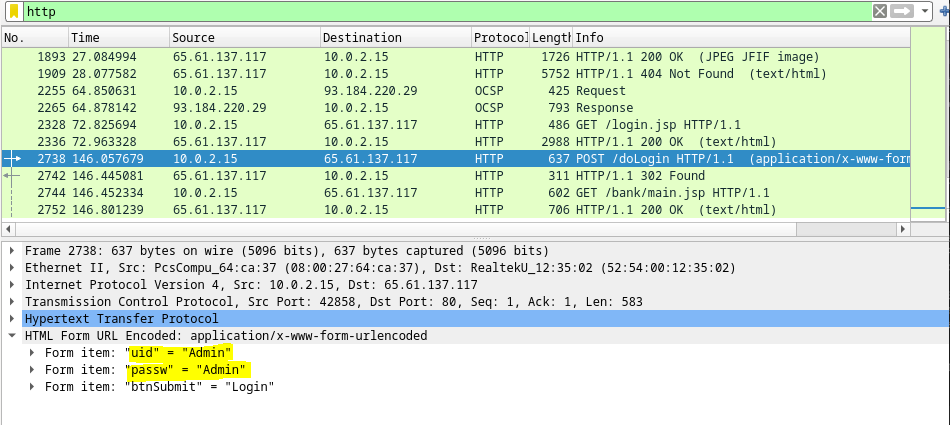
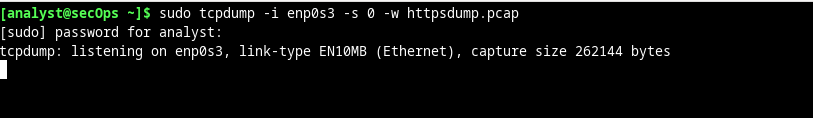
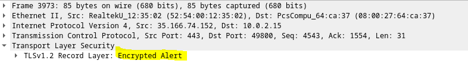
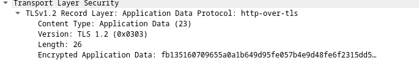

# Utilizar Wireshark para examinar tráfico HTTP y HTTPS

El Protocolo de transferencia de hipertexto (HyperText Transfer Protocol, HTTP) es un protocolo de la capa de aplicación que presenta datos a través de un navegador web. Con HTTP, no se protegen los datos intercambiados entre dos dispositivos que se están comunicando.

Con HTTPS, se emplea cifrado por medio de un algoritmo matemático. Este algoritmo oculta el verdadero significado de los datos que se está intercambiando. Esto se hace mediante el uso de certificados que podremos ver más adelante en esta práctica de laboratorio.

Independientemente de que se utilice HTTP o HTTPS, solo se recomienda intercambiar datos con sitios web de confianza. El solo hecho de que un sitio utilice HTTPS no significa que sea confiable. Los atacantes suelen utilizar HTTPS para ocultar sus actividades.

Usaremos un comando para capturar trafico tcp:

<pre>sudo tcpdump –i enp0s3 –s 0 –w httpdump.pcap</pre>

- La opción de comando ``-i`` les permite especificar la interfaz. Si no se la especifica, tcpdump capturará todo el tráfico en todas las interfaces.

- La opción de comando ``-s`` especifica la longitud de la captura correspondiente a cada paquete. Deberían limitar snaplen a la cifra más pequeña que capturará la información del protocolo en la que están interesados. Si se define snaplen en 0 se lo establece en el valor predeterminado de 262144, para ofrecer retrocompatibilidad con versiones anteriores recientes de tcpdump.

- La opción de comando ``-w`` se utiliza para escribir el resultado del comando tcpdump en un archivo. Si se agrega la extensión .pcap, se garantiza que los sistemas operativos y las aplicaciones podrán leer el archivo. Todo el tráfico registrado se imprimirá al archivo httpdump.pcap, en el directorio de inicio del usuario analyst.

Lo dejamos escuchando y abrimos el navegador por defecto:

Esta pagina es una creada por IBM para dejar claro las vulnerabilidades de una aplicacion web, por tanto no es una real.

El comando tcpdump, que se ejecutó en el paso anterior, imprimió la salida a un archivo de nombre httpdump.pcap. Este archivo está ubicado en el directorio de inicio correspondiente al usuario analyst.

Podemos ir abriendo nuestro archivo `httpdump.pcap`:

Vemos que filtrando por tcp y buscando por POST que es cuando nos hemos logueado, las credenciales se pueden ver de forma HTML decodificada: application/x-www-form-urlencoded.

Ahora haremos lo mismo para `https`:

Después de la sección TCP, ahora hay una sección de sockets seguros (Secure Sockets Layer) (SSL / TLS 1.2) en lugar de HTTP.

La carga de datos se encripta usando TLSv1.2 y no puede visualizarse.

Por tanto cuando se usa HTTPS, la carga de datos de un mensaje está cifrada y solamente puede ser vista por los dispositivos que forman parte de la conversación cifrada.