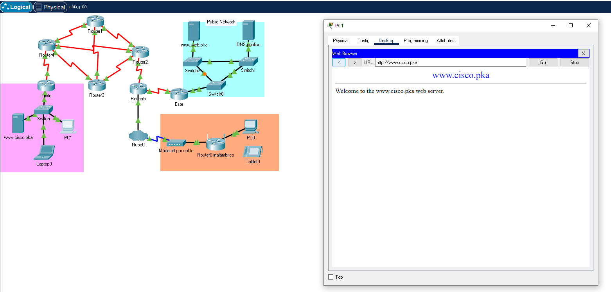
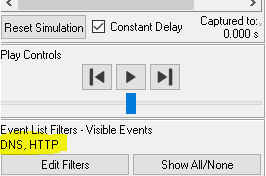
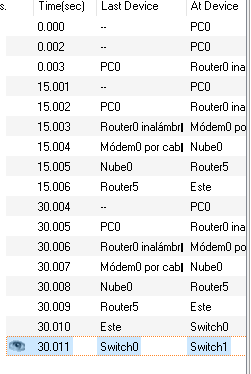
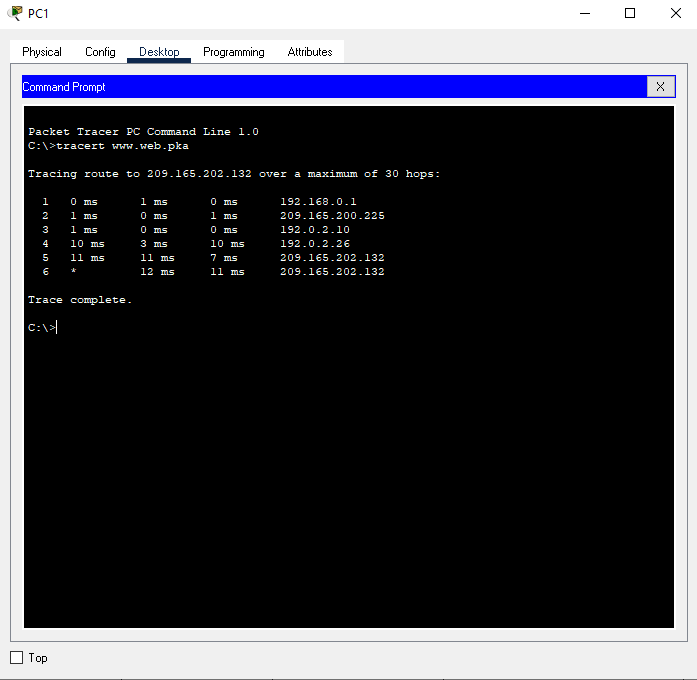

# Packet Tracer: Identificar el flujo de paquetes

Packet Tracer permite diseñar y crear una topología de red simulada. En esta actividad se les presentará una topología simplificada para que observen el flujo de paquetes. Utilizará el modo de simulación de Packet Tracer para estudiar el recorrido de los paquetes por la red. También observará los cambios en un flujo de paquetes cuando hay un cambio en la topología de red.

Haremos una llamada GET a www.cisco.pka usando el PC1

Podemos ver que la conectividad es correcta.

``Usaremos el modo de simulación de Packet Tracer para observar el recorrido del flujo de paquetes por una red LAN remota.``

Usaremos los filtros DNS y HTTP:

Si hacemos click en Capture / Forward (Capturar/Avanzar) hasta que la página web aparezca en PC0 para ver el flujo de paquetes.

Y podemos ver la ruta que sigue.

Si hacemos un `tracert` a la web indicada podemos ver por todos los puntos por donde pasa:

### Lista de tracert

- Router Oeste 192.168.0.1
- Router 4 209.165.200.225
- Router 2 192.0.2.10
- Router 5 192.0.2.26
- Router Este 209.165.202.130
- www.web.pka 209.165.202.132