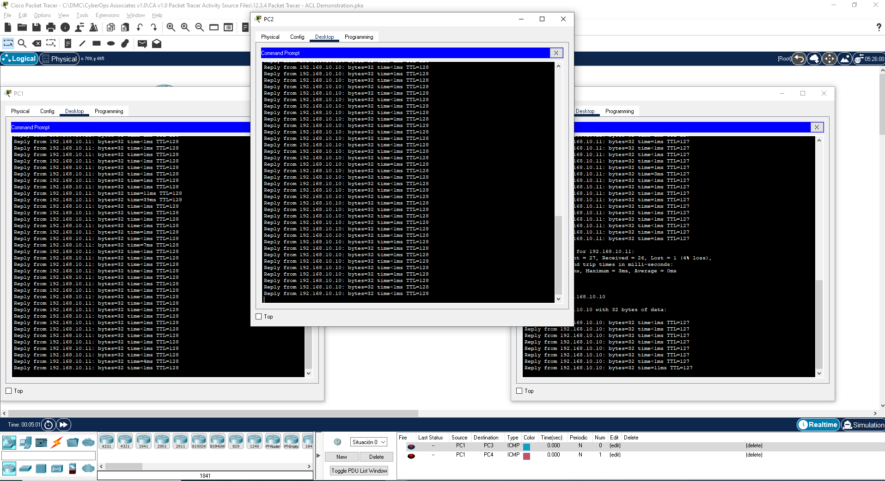
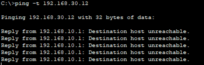

# Packet Tracer: demostración de listas de control de acceso

En esta actividad, observará cómo se puede utilizar una lista de control de acceso (ACL) para evitar que un ping llegue a hosts en redes remotas. Después de eliminar la ACL de la configuración, los pings se realizarán correctamente.

Hacer ping a los dispositivos de la red local para verificar la conectividad.

Vemos que se ven perfectamente

Sin embargo del PC1 al PC4 vemos que no funciona pq no estan en la misma red:

Si usamos los comandos ``show run y show access-lists`` para ver las ACL configuradas actualmente.

