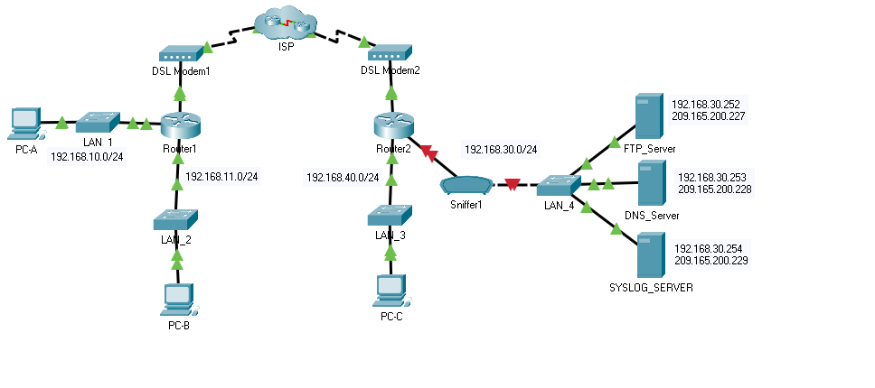
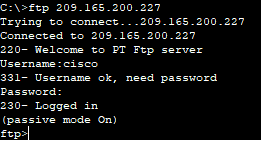
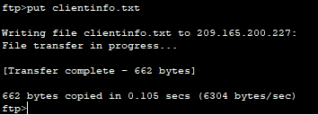
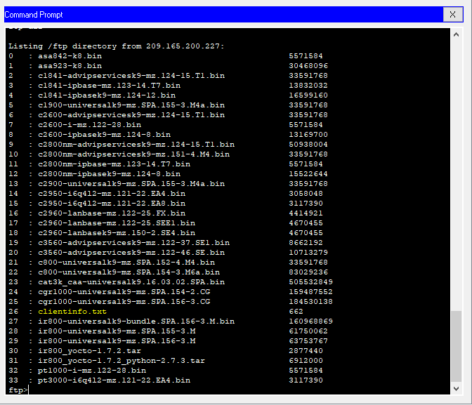
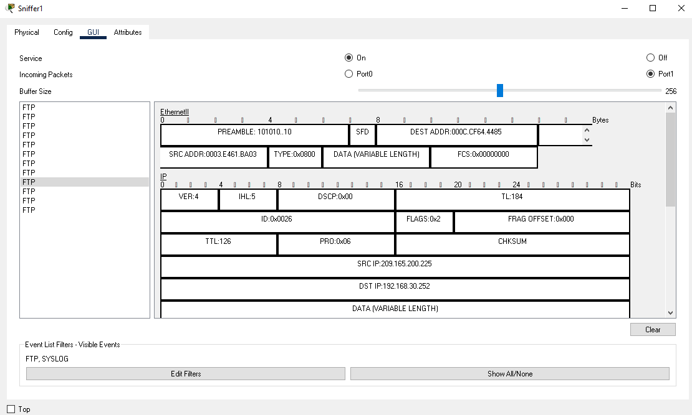
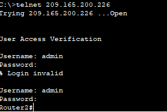
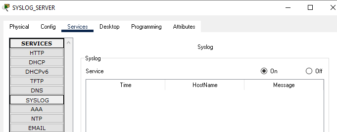
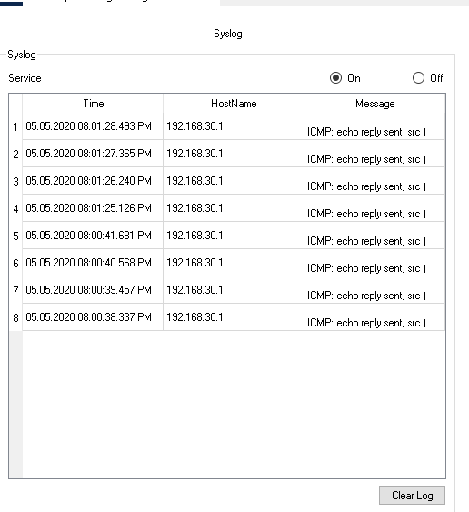

# Packet Tracer: Registrar la actividad de la red

En esta actividad utilizaremos Packet Tracer para analizar y registrar el tráfico de red. Veremos una vulnerabilidad de seguridad en una aplicación de red, y el tráfico ICMP registrado con syslog.

Activar el dispositivo de análisis.
- Haga clic en el dispositivo de análisisSniffer1.

- Dirigirse a la pestaña Physical y encender la fuente de alimentación del analizador.

- Dirigirse a la pestaña GUI y activar el servicio del analizador.

- Se están monitoreando los paquetes FTP y syslog que ingresan al analizador desde Router2.

Conectarse de manera remota al servidor FTP.
- Haga clic en la PC-B y dirigirse a la pestaña Desktop.

- Haga clic en Command Prompt. En el command prompr, abrir una sesión de FTP con FTP_SERVER utilizando la dirección IP pública del dispositivo. Si necesitamos ayuda en la linea de comandos podemos consultarla escribiendo "?" en el prompt.

- Introducir cisco como nombre de usuario y cisco como contraseña para autenticarse con el FTP_Server.

Subir un archivo al servidor FTP.
- Dentro del prompt del ftp> introducir el comando dir para visualizar los archivos almacenados actualmente en el servidor FTP remoto.

- Cargar el archivo llamado "clientinfo.txt" en el servidor FTP utilizando el comando "put clientinfo.txt"

- Dentro del prompt delftp> introducir el comando dir y verifique que el archivo"clientinfo.txt" se encuentre en el servidor FTP.

- Introducir el comando "quit" dentro del prompt del FTP para cerrar la sesión.

Investigar el tráfico de FTP.
- Haga clic en el dispositivo llamado Sniffer1 y luego dirigirse a la pestañaGUI.

- Haga clic en algunos de los primeros paquetes FTP de la sesión. Recordar desplazarse hacia abajo para ver la información sobre el protocolo de capa de aplicación en los detalles de cada paquete. (Se asume que es la primera sesión FTP. Si se han abierto otras sesiones, limpiar la ventana y repetir el proceso de inicio de sesión y transferencia de archivos.)

Para mejorar esto hay que:
- Usar FTPS
- Use una encriptación potente y funciones hash
- Deshabilitar el FTP estándar
- Utilice contraseñas fuertes
- Mantener las bases de datos back-end en un servidor diferente

Conectarse de forma remota al router2.
- Desde la linea de comandos de la PC-B realizar telnet hacia el Router2.

- Utilizar ADMIN como nombre de usuario y como contraseña CISCO para la autenticación.

- Introducir los siguientes comandos en el prompt del router.

<pre>debug ip icmp</pre>

- Introducir el comando logout dentro del prompt para finalizar la sesión de Telnet.

Generar y ver mensajes de Syslog
- Haga clic en el dispositivo llamado SYSLOG_SERVER y luego dirigirse a la pestaña llamada Services.

- Haga clic en el servicio SYSLOG. Verifiquen que el servicio esté activado. Los mensajes de syslog aparecerán aquí.

- Dirigirse a la PC-B y abrir la pestaña Desktop.

- Abra el Command Prompt y realice un ping al Router2.

- Dríjase a la PC-A y abra la pestaña llamada Desktop.

-  Dríjase al command prompt y realice un ping al Router2.

- En el servidor syslog verificar los mensajes que han sido registrados.

- Debe haber cuatro mensajes de PC-A y cuatro de PC-B.

No se pueden saber cual es de cual ya que el echo viene del deafault gateway.