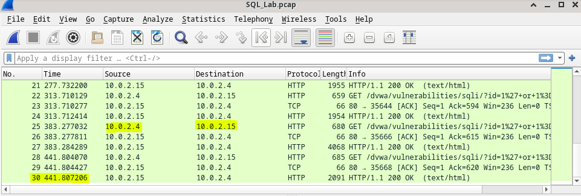
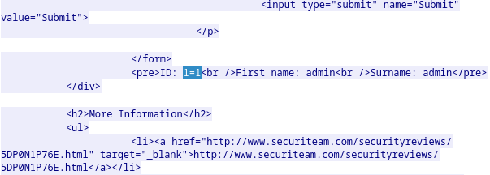
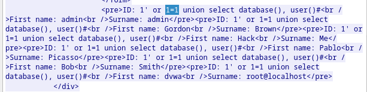
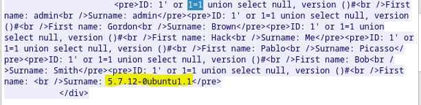
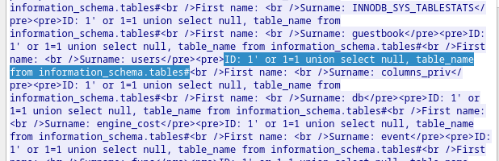
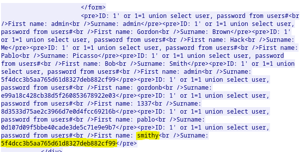

# Attacking a mySQL Database

SQL injection attacks allow malicious hackers to type SQL statements in a web site and receive a response
from the database. This allows attackers to tamper with current data in the database, spoof identities, and
miscellaneous mischief.

A PCAP file has been created for you to view a previous attack against a SQL database. In this lab, you will
view the SQL database attacks and answer the questions.

You will use ``Wireshark``, a common network packet analyzer, to analyze network traffic. After starting
Wireshark, you will open a previously saved network capture and view a step by step SQL injection attack
against a SQL database.

### Open Wireshark and load the PCAP file.

- Click <b> Applications > CyberOPS > Wireshark </b>on the desktop and browse to the Wireshark application.
- In the Wireshark application, click Open in the middle of the application under Files.
- Browse through the /home/analyst/ directory and search for lab.support.files. In the lab.support.files
directory and open the SQL_Lab.pcap file.
- The PCAP file opens within Wireshark and displays the captured network traffic. This capture file extends
over an 8-minute (441 second) period, the duration of this SQL injection attack.



### View the SQL Injection Attack.

- Within the Wireshark capture, right-click line 13 and select Follow > HTTP Stream. Line 13 was chosen
because it is a GET HTTP request. This will be very helpful in following the data stream as the application
layers sees it and leads up to the query testing for the SQL injection.
- The source traffic is shown in red. The source has sent a GET request to host 10.0.2.15. In blue, the
destination device is responding back to the source.
- In the Find field, enter ``1=1``. Click <b>Find Next</b>
- The attacker has entered a query (1=1) into a UserID search box on the target 10.0.2.15 to see if the application is vulnerable to SQL injection. Instead of the application responding with a login failure message, it responded with a record from a database. The attacker has verified they can input an SQL
command and the database will respond. The search string 1=1 creates an SQL statement that will be always true. In the example, it does not matter what is entered into the field, ``it will always be true``.



### The SQL Injection Attack continues...

- Within the Wireshark capture, right-click line 19, and click <b> Follow > HTTP Stream</b>.
- In the Find field, enter 1=1. Click Find Next.
- The attacker has entered a query (1’ or 1=1 union select database(), user()#) into a UserID search box on the target 10.0.2.15. Instead of the application responding with a login failure message, it responded with the following information:



The database name is dvwa and the database user is root@localhost. There are also multiple user
accounts being displayed.
- Close the Follow HTTP Stream window.
- Click Clear display filter to display the entire Wireshark conversation.

### The SQL Injection Attack provides system information.

- Within the Wireshark capture, right-click line 22 and select Follow > HTTP Stream. In red, the source traffic is shown and is sending the GET request to host 10.0.2.15. In blue, the destination device is responding back to the source.
- In the Find field, enter 1=1. Click Find Next.
- The attacker has entered a query ``(1’ or 1=1 union select null, version ()#)`` into a UserID search box on the target 10.0.2.15 to locate the version identifier. Notice how the version identifier is at the end of the output
right before the </pre>.</div> closing HTML code.



### The SQL Injection Attack and Table Information.

The attacker knows that there is a large number of SQL tables that are full of information. The attacker
attempts to find them.
- Within the Wireshark capture, right-click on line 25 and select Follow > HTTP Stream. The source is shown in red. It has sent a GET request to host 10.0.2.15. In blue, the destination device is responding back to the source.
- In the Find field, enter users. Click Find Next.
- The attacker has entered a query (1’or 1=1 union select null, table_name from
information_schema.tables#) into a UserID search box on the target 10.0.2.15 to view all the tables in the database. This provides a huge output of many tables, as the attacker specified “null” without any further
specifications.



```SQL
 (1' OR 1=1 UNION SELECT null, column_name FROM
INFORMATION_SCHEMA.columns WHERE table_name='users')
```

Will retrieve all column names from table `users`.

### The SQL Injection Attack Concludes.

The attack ends with the best prize of all; password hashes.
- Within the Wireshark capture, right-click line 28 and select Follow > HTTP Stream. The source is shown in red. It has sent a GET request to host 10.0.2.15. In blue, the destination device is responding back to the source.
- Click Find and type in 1=1. Search for this entry. When the text is located, click Cancel in the Find text search box.
- The attacker has entered a query ``(1’or 1=1 union select user, password from users#)`` into a UserID
search box on the target 10.0.2.15 to pull usernames and password hashes!
- Using a website such as https://crackstation.net/, copy the password hash into the password hash cracker and get cracking.



`charley` is the password for this user.

In order to prevent this kind of attacks use methods posted in the link below:

https://www.hacksplaining.com/prevention/sql-injection