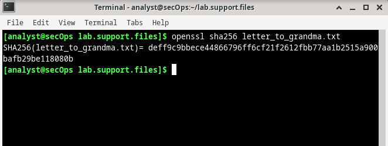
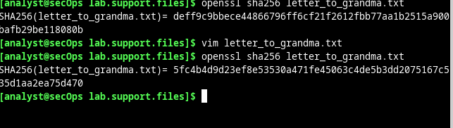

# Convertir elementos en hashes

Las funciones de hash son algoritmos matemáticos diseñados para tomar datos como entrada y generar una cadena de caracteres única de tamaño fijo, también conocida como hash. Diseñadas para que sean veloces, las funciones de hash son muy difíciles de revertir; es muy difícil recuperar los datos que crearon un hash 
determinado, basándose solamente en el hash. Otra de las propiedades importantes de las funciones hash es que hasta el cambio más pequeño realizado en los datos de entrada genera un hash completamente diferente.

Aunque se puede utilizar OpenSSL para generar y comparar hashes, hay otras herramientas disponibles. Algunas de estas herramientas también están incluidas en esta práctica de laboratorio.

### Crear un hash de un Archivo de texto con OpenSSL

OpenSSL se puede utilizar como una herramienta independiente para hashing. Siga los pasos que se indican a continuación para crear un hash de un archivo de texto:

- Abra una ventana de terminal en la máquina virtual CyberOps Workstation.
- Como el archivo de texto del cual se quiere generar un hash se encuentra en el 
directorio ``/home/analyst/lab.support.files/``, ingrese a ese directorio:

<pre>[analyst@secOps ~]$ cd /home/analyst/lab.support.files/</pre>

- Escriba el siguiente comando para generar una lista del contenido del archivo de texto ``letter_to_grandma.txt`` en la pantalla:

<pre>[analyst@secOps lab.support.files]$ cat letter_to_grandma.txt 
Hi Grandma,
I am writing this letter to thank you for the chocolate chip cookies you sent me. I 
got them this morning and I have already eaten half of the box! They are absolutely 
delicious!
I wish you all the best. Love,
Your cookie-eater grandchild.</pre>

- En la misma ventana del terminal, ingrese el siguiente comando para generar un hash del archivo de texto. El comando utilizara ``SHA-2-256`` como algoritmo de hashing para generar un hash del archivo de texto. El hash aparecerá en la pantalla después de que OpenSSL lo haya computado.

- Las funciones de hash son útiles para verificar la integridad de los datos independientemente de que se traten de una imagen, una canción o un simple archivo de texto. El cambio más pequeño produce un hash completamente diferente. Los hashes se pueden calcular antes y después de la transmisión, para 
luego compararlos. Si los hashes no coinciden, los datos fueron modificados durante la transmisión.Modifique el archivo de texto letter_to_grandma.txt y vuelva a calcular el hash MD5. Ingrese el siguiente 
comando para abrir nano, un editor de texto operado por línea de comandos (command-line text editor).

<pre>[analyst@secOps lab.support.files]$ nano letter_to_grandma.txt</pre>

- Utilice nano para cambiar la primera oración de ‘Hi Grandma’ a ‘Hi Grandpa’. Observe que solo estamos cambiando un carácter: la ‘m’ a una ‘p’. Después de hacer el cambio, presione las teclas <CONTROL+X> para guardar el archivo modificado. Presione ‘Y’ (Sí) para confirmar el nombre y guardar el archivo. Presione la tecla <Enter> y saldrá del editor nano para continuar con el siguiente paso.

- Ahora que se ha modificado y guardado el archivo, vuelva a ejecutar el comando para generar un hash SHA-2-256 del archivo.

El hash es muy diferente.

- También se puede usar un algoritmo de hashing con una longitud de bits más larga, como SHA-2-512. Utilice el siguiente comando para generar un hash SHA-2-512 del archivo letter_to_grandma.txt :

<pre>$ openssl sha512 letter_to_grandma.txt</pre>

- Utilice sha256sum y sha512sum para generar un hash de SHA-2-256 y SHA-2-512 del archivo letter_to_grandma.txt:

### Verificar Hashes

Como se mencionó antes, un uso común de los hashes es verificar la integridad de los archivos. Sigan los pasos que se detallan a continuación para utilizar hashes SHA-2-256 y verificar la integridad de sample.img, un archivo que se descargó de Internet.

<pre>$ sha256sum sample.img</pre>

Si bien comparar hashes un método relativamente robusto para detectar errores de transmisión, hay mejores formas de garantizar que el archivo no ha sido modificado. Herramientas, como gpg, proporcionan métodos mucho mejores para garantizar que el archivo descargado no haya sido modificado por ningún tercero, y que es efectivamente el archivo que el editor quería publicar.
