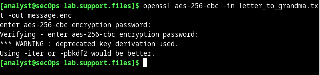
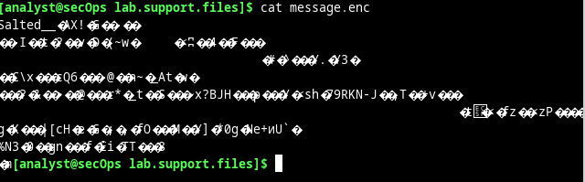
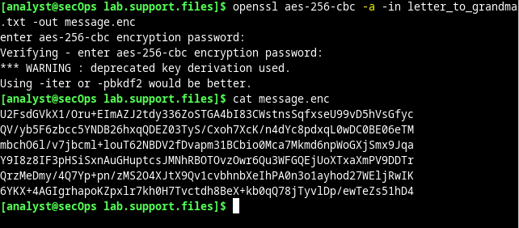
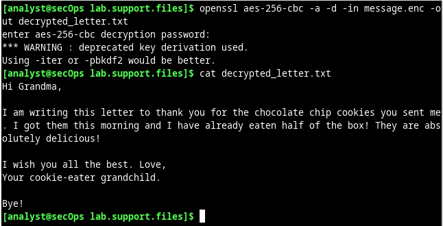

# Cifrar y Descifrar Datos con OpenSSL

OpenSSL es un proyecto de código abierto que proporciona un kit de herramientas robusto, comercial ycompleto para los protocolos de Seguridad de capa de transporte (Transport Layer Security, TLS) y Capa de sockets segura (Secure Sockets Layer, SSL). También es una biblioteca de criptografía de uso general. En
esta práctica de laboratorio utilizarán OpenSSL para cifrar y descifrar mensajes de texto.

Esta práctica de laboratorio debe utilizarse solo con fines instructivos. Los métodos aquí presentados NO se deben emplear para asegurar datos realmente sensibles.

### Cifrar mensajes con OpenSSL

OpenSSL se puede utilizar como una herramienta independiente para el cifrado. Aunque pueden utilizarse muchos algoritmos de cifrado, esta práctica de laboratorio se enfoca en AES. Si quieren utilizar AES para cifrar un archivo de texto directamente desde la línea de comando utilizando OpenSSL, sigan los pasos que se indican a continuación:

- Iniciar sesión en la Máquina Virtual "CyberOPS Workstation."
- Abrir una ventana del terminal.
- El archivo de texto que se debe cifrar se encuentra en el directorio /home/analyst/lab.support.files/, cambie a ese directorio:
- Escribir el siguiente comando a continuación para generar una lista del contenido del archivo de texto encriptado letter_to_grandma.txt en la pantalla:
    <pre>cat letter_to_grandma.txt</pre>
- En la misma ventana del terminal, emitir el siguiente comando para cifrar el archivo de texto. El comando usará AES-256 para cifrar el archivo de texto y guardar la versión cifrada como message.enc. OpenSSL nos pedirá una contraseña y pedirá que la confirmemos. Proporcionar la contraseña tal como se les solicita y recordarla.
    <pre>
    $ openssl aes-256-cbc -in letter_to_grandma.txt -out message.enc
    enter aes-256-cbc encryption password:
    Verifying - enter aes-256-cbc encryption password:
    </pre>

    

    La contraseña es `Passw0rd`

- Cuando hayamos terminado el proceso, hay que volver a utilizar el comando cat para mostrar el contenido del archivo message.enc.

    

    Como se puede observar el contenido esta encriptado y no se puede ver. Los símbolos se muestran porque OpenSSL generó un archivo binario.

- Para que el archivo sea legible, volvamos a ejecutar el comando OpenSSL pero esta vez agreguemos la opción -a. La opción -a le indica a OpenSSL que debe cifrar el mensaje cifrado con un método de codificación diferente a Base64 antes de guardar el resultado en un archivo.

    <pre>openssl aes-256-cbc -a -in letter_to_grandma.txt -out message.enc</pre>

    

    Mientras que message.enc está encriptado, ahora se muestra correctamente porque se convirtió de binario a texto y se codificó como Base64.

### Parte 2: Descifrar mensajes con OpenSSL

- Utilizar el siguiente comando para descifrar message.enc:

<pre>openssl aes-256-cbc –a -d -in message.enc -out decrypted_letter.txt</pre>

- OpenSSL les pedirá la contraseña que se utilizó para cifrar el archivo. Vuelvan a introducir la misma contraseña.

- Cuando OpenSSL termine de descifrar el archivo message.enc, lo guardará en un archivo de texto de nombre decrypted_letter.txt. Utilicen el comando cat para mostrar el contenido de decrypted_letter.txt

