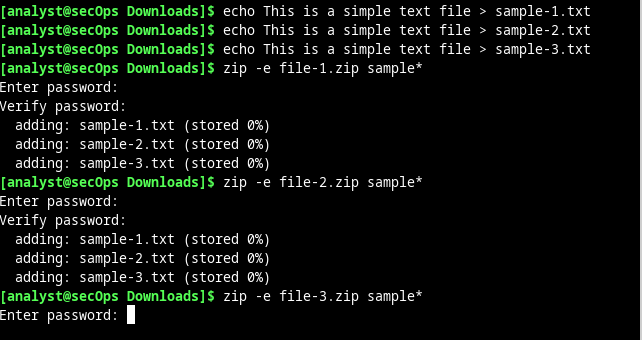
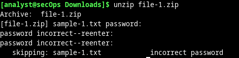
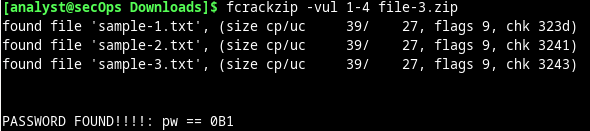

# Encriptar y desencriptar datos utilizando una herramienta de Hacker

Entre algunos ejemplos de utilidades y programas para recuperar contraseñas podemos mencionar los siguientes: hashcat, John the Ripper y Lophtcrack. En nuestro caso, utilizaremos fcrackzip, una simple utilidad de Linux para recuperar las contraseñas de archivos zip cifrados.

- Iniciar la Máquina Virtual CyberOps Workstation.
- Abrir una ventana del terminal. Verificar que están en el directorio de inicio de analyst. Si no es así, introducir ``cd ~`` en el prompt del terminal.
- Crear una carpeta nueva de nombre Zip-Files con el comando mkdir Zip-Files.
- Ingresar a ese directorio con el comando cd Zip-Files.
- Introduzca el siguiente texto para crear tres archivos de texto.

<pre>
echo This is a sample text file > sample-1.txt
echo This is a sample text file > sample-2.txt
echo This is a sample text file > sample-3.txt
</pre>

- Utilicen el comando `ls` para verificar que se hayan creado los archivos.
- Utilicen el siguiente comando para crear un archivo zip cifrado de nombre file-1.zip que contenga los tres archivos de texto:

<pre>zip –e file-1.zip sample*</pre>

- Cuando se le solicite una contraseña, introduzca una de un carácter de su elección. En el ejemplo se introdujo la letra B. Introduzcan la misma letra cuando se les solicite verificarla.

- Repitan el procedimiento para crear los siguientes 4 archivos
    - file-2.zip con una contraseña de 2 caracteres de su elección. En nuestro ejemplo, utilizamos ``R2``.
    - file-3.zip con una contraseña de 3 caracteres de su elección. En nuestro ejemplo, utilizamos ``0B1``.
    - file-4.zip con una contraseña de 4 caracteres de su elección. En nuestro ejemplo, utilizamos ``Y0Da``.
    - file-5.zip con una contraseña de 5 caracteres de su elección. En nuestro ejemplo, utilizamos ``C-3P0``.

- Utilice el comando ``ls -l f*`` para verificar que se hayan creado todos los archivos comprimidos.

- Traten de abrir un zip con una contraseña incorrecta, tal como se muestra.

Utilizaremos la utilidad ``fcrackzip`` para recuperar contraseñas olvidadas de archivos comprimidos cifrados. Fcrackzip busca archivos cifrados en cada archivo zip dado para adivinar la contraseña utilizando métodos de fuerza bruta.
El motivo por el cual creamos archivos zip con contraseñas de diversas longitudes es ver si la longitud de la contraseña tiene alguna influencia sobre el tiempo necesario para descubrirla.

- Ahora traten de recuperar la contraseña del archivo file-1.zip. Recordemos que se utilizó una contraseña de un carácter para cifrar el archivo. Por lo tanto, utilizaremos el siguiente comando fcrackzip:

<pre>fcrackzip -vul 1-4 file-1.zip</pre>

Para una contraseña de 1-4 no tarda ni dos segundos.
Para una contraseña de 5-10 tarda más tiempo.

