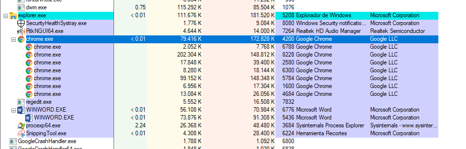
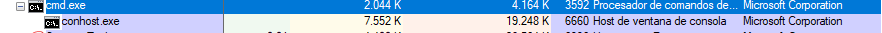
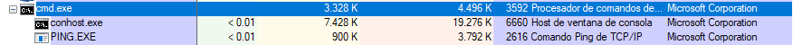
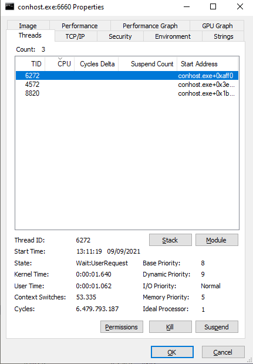
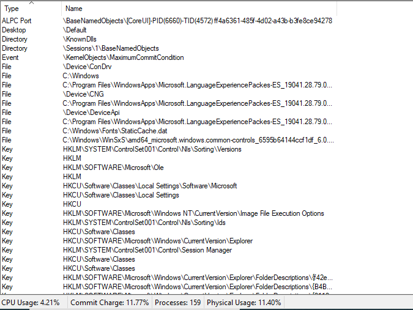
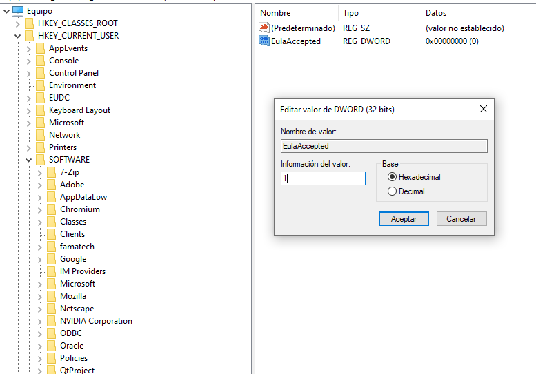

# <pre>procexp.exe</pre> Nos muestra una lista de los procesos activos actualmente

- Si hacemos click derecho sobre un proceso esto muestra diferentes opciones entre ellas Kill Process. Si hacemos click sobre el proceso de Chrome esto elimina inmediatamente la ventana del navegador web.

- Si abrimos una terminal nueva usando<pre>WIN + R</pre>y en la casilla escribimos:<pre>CMD</pre> y le damos a ENTER podremos obsevar un nuevo proceso que se abre en primer plano.

Si hacemos un PING en la terminal podemos observar que se abre un proceso en background 

### <i>Cabe destacar que si matamos un proceso primario el secundario tambien muere.</i>

- Si hacemos click derecho y nos vamos a propiedades podemos ver toda la información sobre dicho proceso como variable de entorno, información de seguridad, información de rendimiento y cadenas imprimibles. Podemos ver en este caso cuantos hilos estan activos.

- En el Explorador de procesos, hagan clic en Vista > seleccionar Vista de panel inferior > Controles para ver los controles asociados con el proceso conhost.exe.

### <i>Estos apuntan a ficheros, subprocesos y claves de registro.</i>

- En un paso anterior había aceptado el acuerdo EULA correspondiente al Explorador de procesos. Diríjanse a la clave del registro EulaAccepted correspondiente al Explorador de procesos usando <b>regedit.exe</b>.
Para seleccionar el Explorador de procesos, hagan clic en HKEY_CURRENT_USER > Software > Sysinternals > Process Explorer. Desplácese hacia abajo para ubicar la clave EulaAccepted. En este momento, el valor correspondiente a la clave de registro EulaAccepted es 0x00000001(1). 
Hagan doble clic en la clave del registro EulaAccepted. En este momento, el dato del valor está definido en 1. El valor de 1 indica que el acuerdo EULA ha sido aceptado por el usuario. 
Cambien el 1 por un 0 en el dato del Valor. El valor de 0 indica que no se aceptó el EULA. Hagan clic en OK (Aceptar) para continuar.

### <i>Si hacemos esto nos volvera a saltar el EULA para aceptar las condiciones</i>