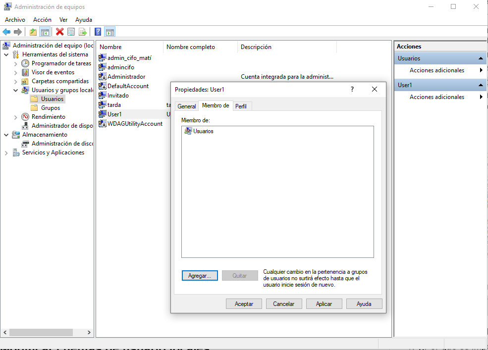
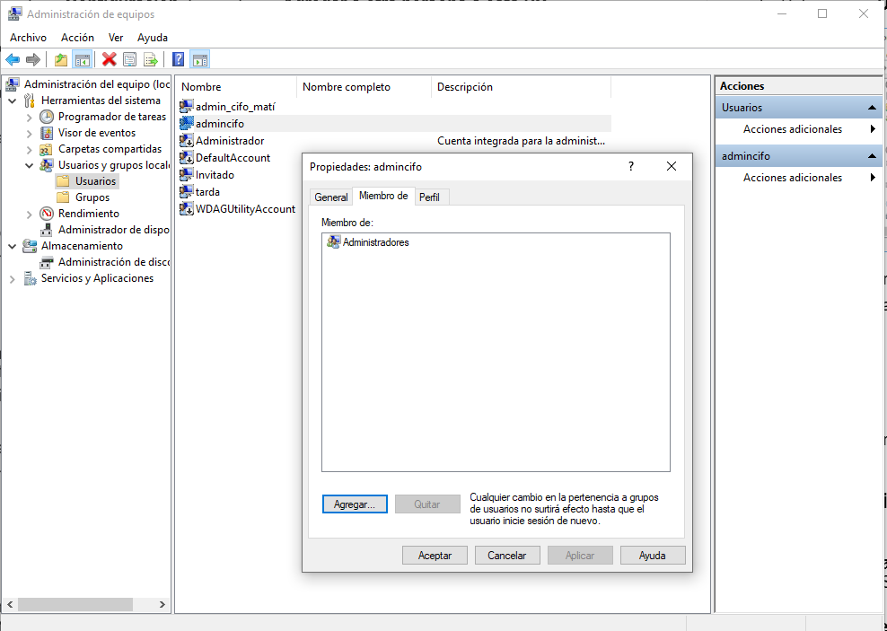
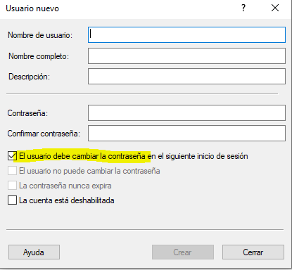

# Crear cuentas de usuario

Por defecto si creas una cuenta nueva en Windows, este será usuario default sin derechos de administrator. 
- Despues de iniciar sesión con este nuevo usuario creado si te dirijes a la carpeta <b>C:\Usuarios</b>. Hagan clic derecho sobre la carpeta <b>User1</b> y seleccionen <b>Propiedades</b>; luego, elijan la ficha <b>Seguridad</b>. 
Los que tienen derecho sobre esta carpeta son los  Grupos: <ul>
    <li>Sistema</li>
    <li>administradores</li>
    </ul>Usuarios:<ul><li>usuario 1</li>
</ul>

### <i>Por defecto si vemos las propiedades de un usuario normal este pertenece al grupo de usuarios</i>

### <i>Este sin embargo podemos ver que pertenece al grupo de los Administradores</i>

Es importante proteger todas las cuentas con una contraseña fuerte para que nadie pueda tener acceso ni robarle los datos en la sesión con su usuario y psw. 
Se puede crear sin embargo un usuario estandar sin contraseña eligiendo que el usuario a la primera vez que inicie la sesion le pida agregar una contraseña nueva.

