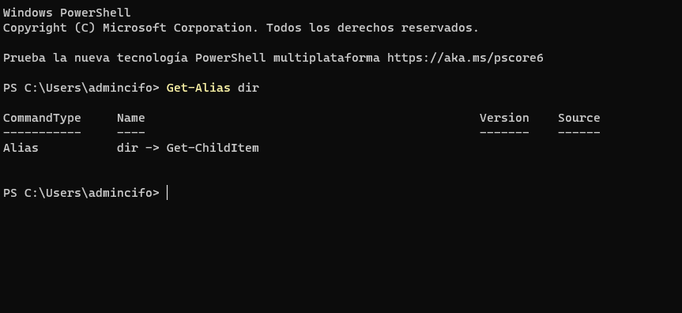
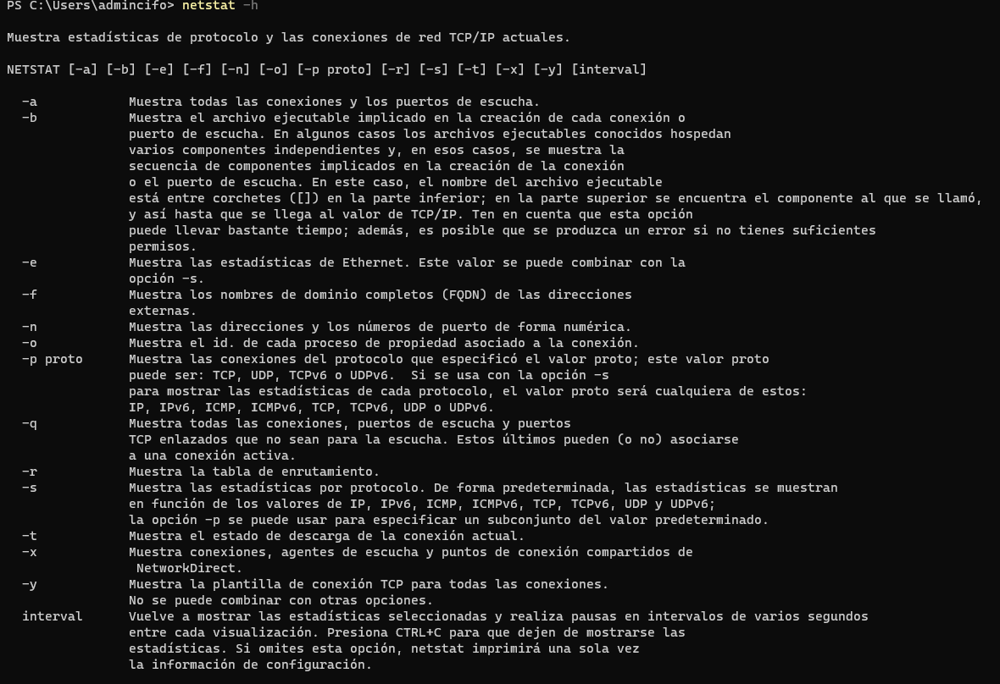
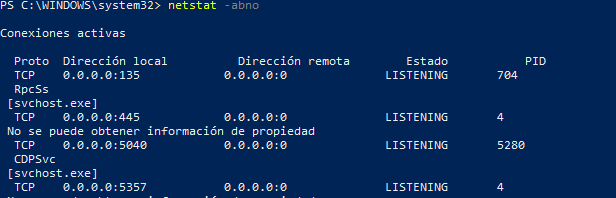
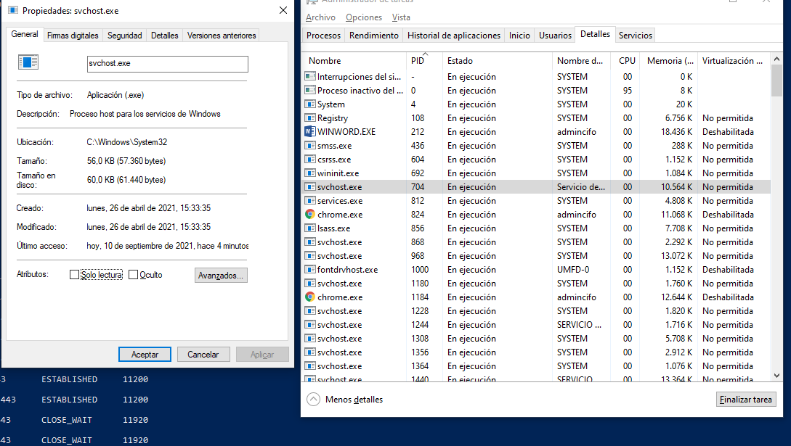

# Windows PowerShell

Los comandos de PowerShell, cmdlets, se construyen como una cadena de verbo-sustantivo. Para identificar el comando de PowerShell que se utilizará para generar una lista de los subdirectorios y archivos presentes en un directorio, introduzcan Get-Alias dir en el cursor de PowerShell.

### <i>Por ejemplo el correspondiente al commando DIR es Get-Children</i>

<pre>netstat</pre>

Muestra estadísticas de protocolo y las conexiones de red TCP/IP actuales. 

Con <b>netstat -abno</b> con privilegios de admin, se pueden visualizar diferentes procesos que estan usando la red:

Si vamos a administrador de tareas podemos ver el PID asociado:

- El PID 704 está asociado con el proceso svchost.exe. El usuario para este proceso es SERVICIO DE RED y está utilizando 56.0 K de memoria

### <i>Tambien se pueden usar mas commandos en PowerShell como por ejemplo:</i>

<pre>clear-recyclebin</pre>

### <i>Este ultimo borra los archivos de la papelera de reciclaje</i>

## Commandos utiles podrian ser los siguentes:

<pre>
Get-NetAdapter

Restart-NetAdapter

Get-NetIPInterface

Get-NetIPAddress

Get-NetRoute

Get-NetConnectionProfile

Get-DNSClientCache

Get-DNSClientServerAddress

Register-DnsClient

Set-DnsClient

Set-DnsClientGlobalSetting

Set-DnsClientServerAddress

Set‑NetIPAddress

Set‑NetIPv4Protocol

Set‑NetIPInterface

Test-Connection

Test-NetConnection

Resolve-Dnsname
</pre>