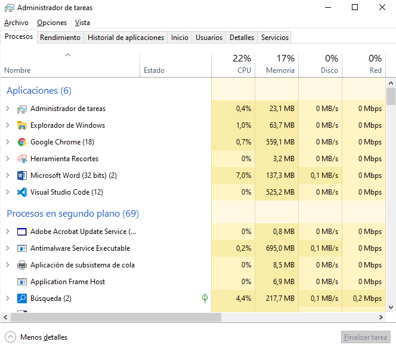
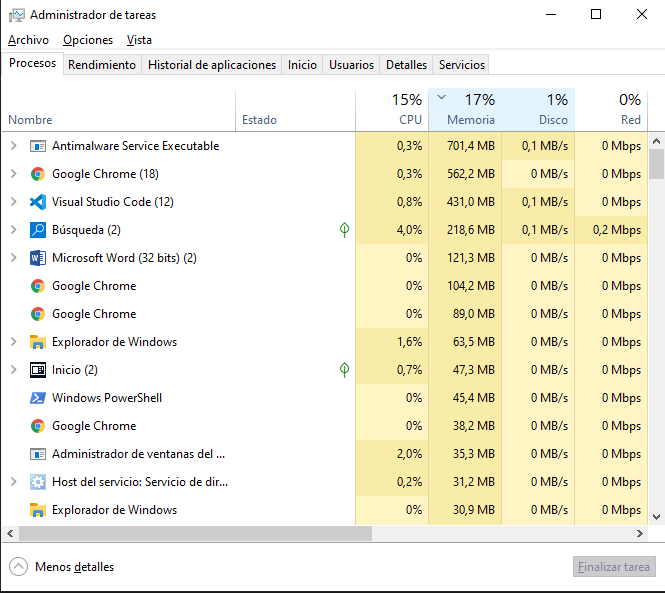
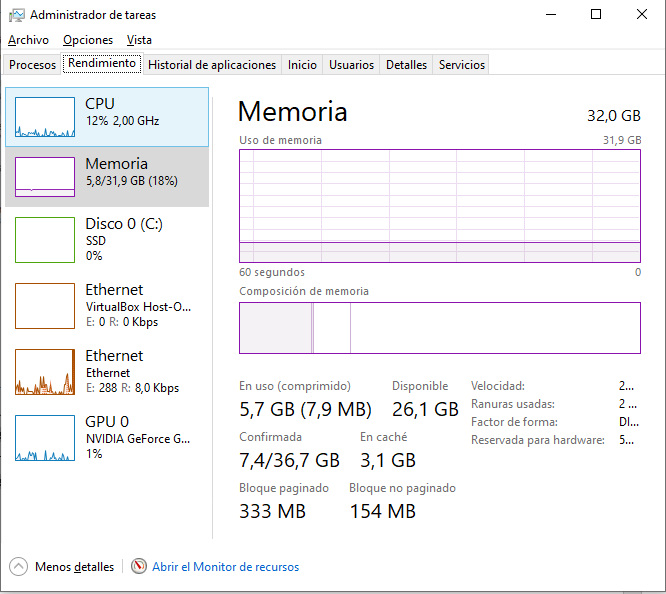

# Administrador de tareas de Windows

Hagan clic derecho sobre la barra de tareas para abrir el Administrador de tareas. Otra forma de abrir el Administrador de tareas es presionar Ctrl-Alt-Supr para acceder a la pantalla de Seguridad de Windows y seleccionar Administrador de tareas.

En la ficha Procesos aparecen tres categorías de procesos: Aplicaciones, Procesos en segundo plano y Procesos de Windows.
Las Aplicaciones son las que tiene abiertas, como Microsoft Edge, el Administrador de tareas y el Procesador de comandos de Windows, tal como se indica en la figura de arriba. Aquí también se incluirán otras aplicaciones abiertas por los usuarios, como los navegadores web y los clientes de correo electrónico. 

Los Procesos en segundo plano son ejecutados en segundo plano por las aplicaciones que están abiertas en este momento.
Los Procesos de Windows no se muestran en la figura. Desplácense hacia abajo para verlos en sus PC Windows. Los Procesos de Windows son servicios de Microsoft Windows que se ejecutan en segundo plano. 

- Si se hace clic en el encabezado de la memoria permite que los procesos se clasifiquen por la cantidad de memoria que cada proceso está utilizando. Cada vez que haga clic en el encabezado de la memoria, revierte el pedido (el más grande hasta el más pequeño, el más pequeño hasta los más grandes)

- Tambien se puede visualizar en porcentajes la memoria
- Ademas de los procesos podemos visualizar el uso de la memoria, cpu, gpu, disco y red en la pestaña rendimiento

