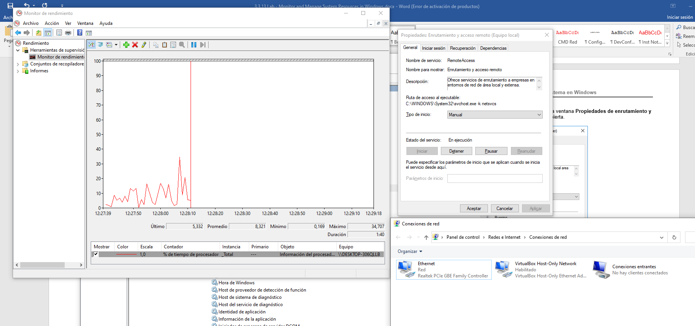
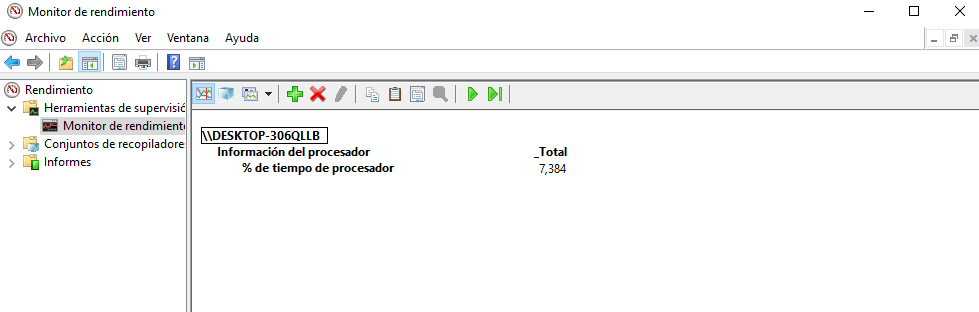
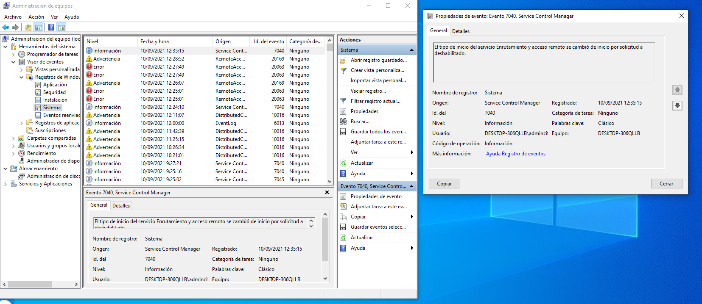
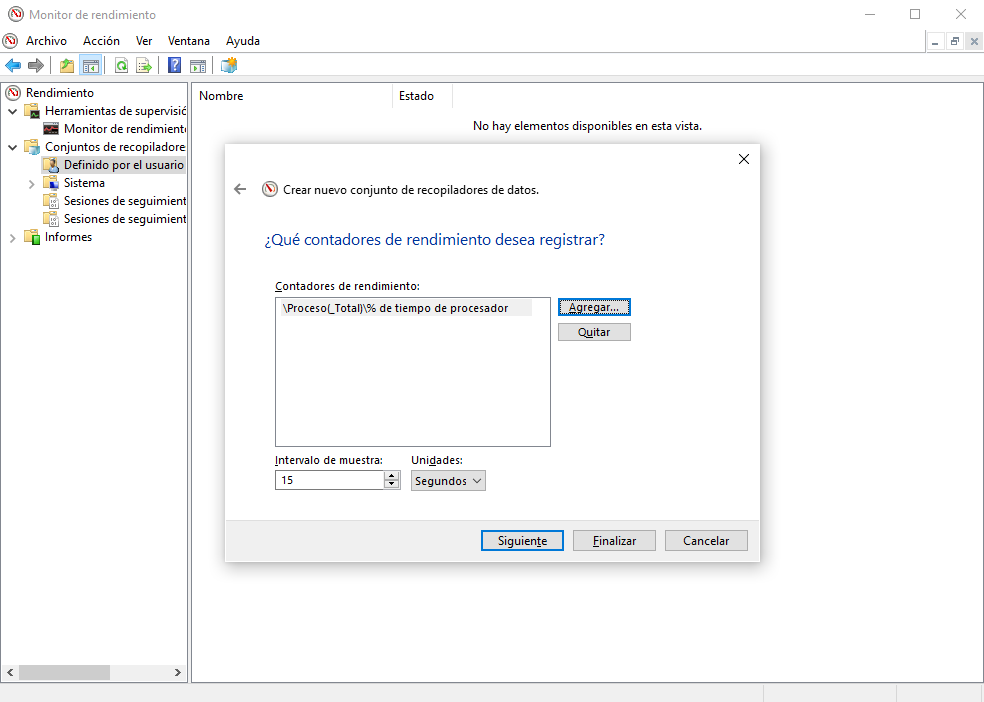

# Monitorear y administrar recursos del sistema en Windows

Si ejecutamos el servicio de enrutamiento y acceso remoto de forma manual podemos apreciar un cambio en el grafico de performance monitor y en el centro de redes y conexiones de redes nos aparece un nuevo icono con conexiones entrantes.

Y si detenemos el servicio este icono ya no aparece.

Si cambiamos a modo informe el grafico podemos ver lo siguente:

Otra utilidad es La Administración de equipos, y se utiliza para administrar una computadora local o remota. Las herramientas de esta utilidad están agrupadas en tres categorías: herramientas del sistema, almacenamiento, y servicios y aplicaciones.

Podemos apreciar como por ejemplo el visor de eventos y registros del sistema, en este caso si hacemos dobleclick sobre el ultimo log nos dice que (El tipo de inicio del servicio Enrutamiento y acceso remoto se cambió de inicio por solicitud a deshabilitado.) que es lo ultimo que se ha realizado. La descripción puede variar segun cada evento y log.

En Windows dentro de Monitor de Rendimiento tambien se puede generar un conjunto de recopilación de datos, estos puedes ser de lo que sea (memoria, proc %, net uso, etc):

Se genera un log o informe con los datos elegidos cada intervalo e tiempo en la ruta %systemdrive%\PerfLogs\..... y el nombre del equipo + el fichero.csv

