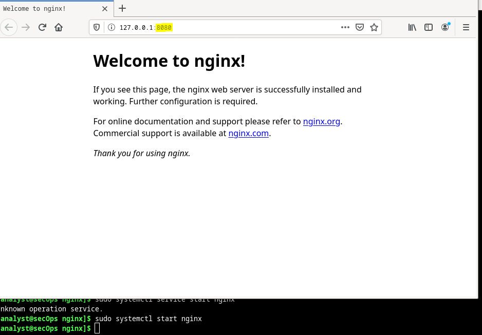

#  Trabajar con archivos de texto en la CLI

En linux tenemos diferentes editores de texto como por ejemplo SciTE:

Tambien se puede ejecutar SciTe desde la terminal en segundo plano, lo que significa que la presente terminal quedara inutilizable hasta que finalicemos el programa.

### Tambien se pueden utilizar editores como vim o nano usando solo la terminal, sin interfaz grafica, lo que es mas util ya que muchas veces no disponemos de interfaz.

Los usuarios con los niveles de permisos correctos utilizan editores de texto para cambiar el contenido de archivos de configuración. Después de realizados los cambios, se guarda el archivo que ya puede ser utilizado por el servicio o la aplicación relacionados. Los usuarios pueden especificar exactamente cómo
quieren que se comporte cualquier aplicación o servicio determinado. Cuando se abren, los servicios y las aplicaciones comprueban el contenido de archivos de configuración específicos y ajustan su comportamiento
en consecuencia.

### Podemos usar otros comandos para listar nuestros archivos ocultos como:

<pre>ls -al</pre>

Podemos hacer una prueba de cambiar algun fichero .conf usando vim. En este caso cambiaremos el puerto de escucha de nginx, que es un servidor ligero web con capacidades de redirecionamiento.

Podemos observar que al arrancar el servicio nginx este escucha por el puerto que hemos asignado

