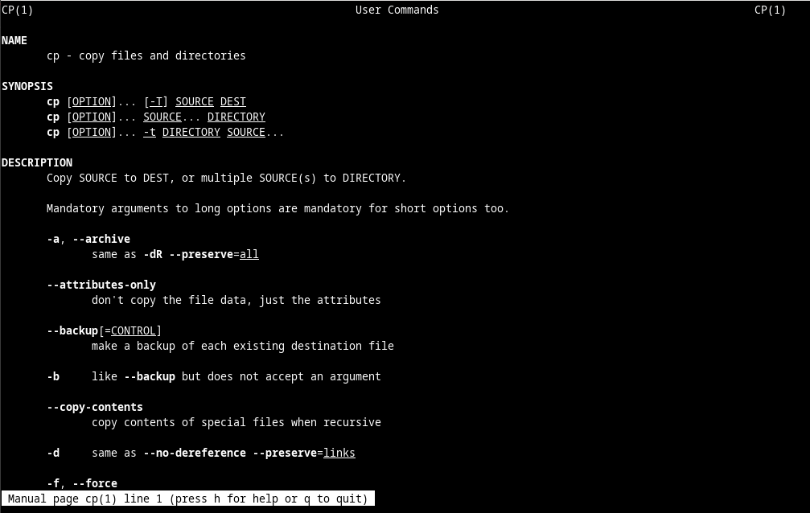

# Familiarizarse con el shell de Linux

Shell es el término que se utiliza para hacer referencia al intérprete de comandos de Linux. También conocido como Terminal, Línea de comandos o Símbolo del sistema, el shell es un método muy versátil para interactuar con una computadora Linux.

Para acceder al manual sobre cualquier commando en Linux usamos <pre>$ man</pre>

En el ejemplo podemos ver el uso de <b>man</b> junto con el commando <b>cp</b>



<b>cp</b> se usa para copiar archivos y directorios en Linux <br>
<b>pwd</b> se usa para imprimir la ruta absoluta de la ubicación actual en Linux

<pre>$ ls -al</pre>

Este commando de arriba muestra todos los archivos y carpetas ocultos o no de la ubicación actual, ademas de los permisos de estos.

<b>mkdir</b> se usa para crear nuevos directorios

En la terminal el simbolo:
- `$` nos dice que tenemos permisos de usuario normal
- `#` nos dice que estamos con el usuario root y por tanto permisos admin
- `~` nos dice que estamos en la carpeta de inicial del usuario actual (la home)
- `/` nos dice que estamos en la la raiz
- `.` un punto antes de cualquier archivo nos dice que este esta oculto

Si queremos acceder a la carpeta del usuario actual usamos <b>cd</b> o <b>cd ~</b>

Nos movemos o navegamos usando la direcion absoluta del lugar donde queremos ir o usando <b>cd</b> y la carpeta que queremos en la ruta relativa.

<pre>cd /etc</pre>
Movernos usando la ruta absoluta
<pre>cd ..</pre>
Este ultimo nos sube un nivel desde donde estamos ubicados.
<pre>cat</pre>
Este nos imprime en la pantalla el contenido de un archivo de texto

Otro potente operador de la línea de comandos de Linux se conoce como redirect. Representado por el símbolo <b>`>`</b>, este operador permite redireccionar la salida de un comando a otra ubicación que no sea la ventana del terminal actual (la opción predeterminada)

```sh
echo This is a message echoed to the terminal by echo. > some_text_file.txt
```

En forma similar a lo que ocurre con el operador ``>``, ``>>`` también permite redireccionar datos a archivos. La diferencia es que ``>>`` anexa datos al final del archivo en cuestión, y mantiene el contenido actual intacto. Para anexar un mensaje a some_text_file.txt, emitir el siguiente comando:

<pre>rm</pre>
Con este commando podemos eliminar archivos
<pre>rm -rf</pre>
Con este podemos eliminar de forma recursiva carpetas
<pre>cp -r</pre>
Lo mismo copiar de forma recursiva usando `-r`