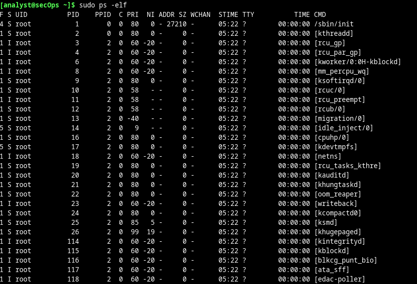
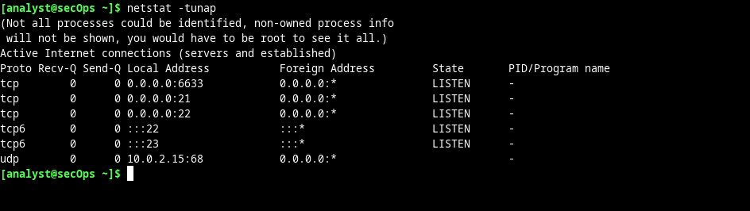
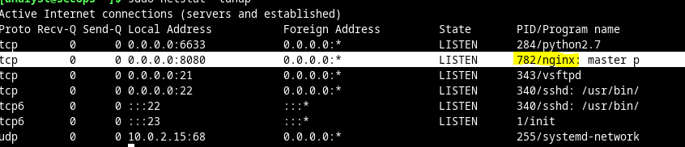
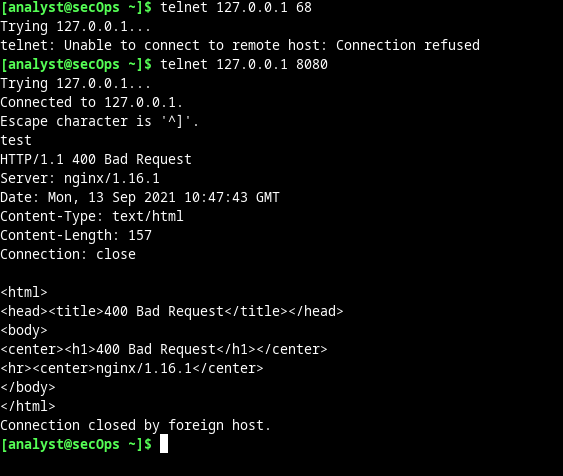

# Práctica de laboratorio: Servidores Linux

Los servidores son esencialmente programas escritos para proporcionar información específica por solicitud. Los clientes, que también son programas, se comunican con el servidor, hacen la solicitud y aguardan la respuesta del servidor. Se pueden utilizar muchas tecnologías diferentes de comunicación entre clientes y servidores; las más comunes son las redes IP. 

Se pueden estar ejecutando muchos programas diferentes en una computadora determinada, especialmente en una con el sistema operativo Linux. Muchos programas se ejecutan en segundo plano, por lo que es posible que los usuarios no detecten inmediatamente qué programas se están ejecutando en una computadora determinada. En Linux, a los programas en ejecución también se les llama procesos.

<pre>ps</pre>
<pre>sudo ps –elf</pre>

Utilicen el comando `ps -elf` para mostrar todos los programas que se están ejecutando en segundo plano.(se deberá de escalar privilegios para ello)

Utilizar las opciones de ``-ejH`` para mostrar el árbol de procesos que se está ejecutando actualmente después de iniciar el servidor web nginx con privilegios elevados.(se muestran por indentación)

El comando ``netstat`` es una excelente herramienta para identificar más fácilmente a los servidores de red que se están ejecutando en una computadora. El poder de netstat radica en su capacidad para mostrar conexiones de red.

<pre>netstat -tunap</pre>

- `a` muestra los sockets de escucha y no escucha
- `n` utiliza resultados numéricos (sin resolución DNS, de puerto de servicio o de nombre de usuario)
- `p` muestra el PID del proceso propietario de conexión
- `t` muestra las conexiones TCP
- `u` muestra las conexiones UDP

El orden es irrelevante.

Telnet es una aplicación de shell remoto simple. Telnet se considera inseguro ya que no proporciona cifrado. Los administradores que optan por utilizar Telnet para administrar dispositivos de red y servidores en forma remota dejan expuestas las credenciales para iniciar sesión en ese servidor, ya que Telnet transmitirá los datos de la sesión como texto sin cifrar. Si bien no se recomienda utilizar Telnet como aplicación de shell remoto, puede ser muy útil para pruebas rápidas o para recopilar información sobre servicios TCP. 

Es util mientras no se utilice como un shell remoto. Es perfectamente seguro probar o recopilar rápidamente información sobre un servicio de red determinado
El protocolo Telnet funciona en el puerto 23, por medio de TCP de manera predeterminada. 

El cliente telnet, sin embargo, permite especificar otro puerto. Si se cambia el puerto y se establece una conexión con un servidor, el cliente telnet permite que un analista especializado en redes evalúe rápidamente la naturaleza de un servidor específico comunicándose directamente con él.

`telnet` solo puede acceder por TCP cualquier puerto UDP no funcionaria.