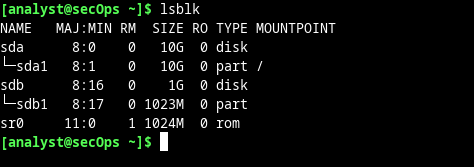
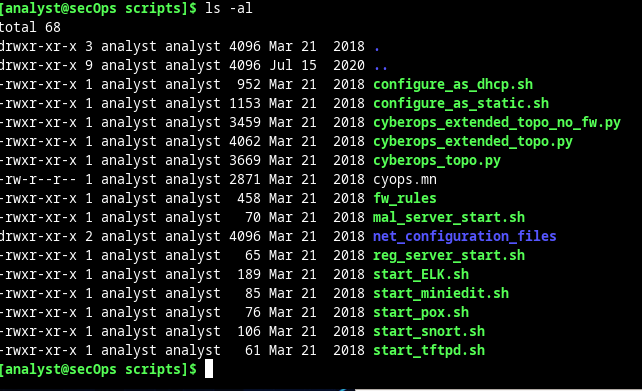
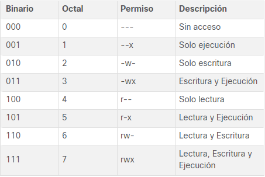

# Navegar por el sistema de archivos y la configuración de permisos de Linux

El sistema de archivos de Linux es una de sus características más populares. Si bien Linux admite muchos tipos diferentes de sistemas de archivos, aquí nos enfocaremos en la familia ext, uno de los sistemas de archivos más comunes en Linux.

Los sistemas de archivos se deben montar primero para poder acceder a ellos y utilizarlo. En informática, montar un sistema de archivos significa tomar las medidas necesarias para que el sistema operativo pueda acceder a él. El montaje de un sistema de archivos es el proceso de vincular la partición física en el dispositivo de bloques (disco duro, unidad SSD, pen drive, etc.) a un directorio, a través del cual se puede acceder a todo el sistema de archivos. Como el directorio antes mencionado pasa a ser la raíz del sistema de archivos recién montado, también se lo conoce como punto de montaje.

<i>Utilicen el comando ``lsblk`` para mostrar todos los dispositivos de bloques</i>
<pre>lsblk</pre>

A menudo, Linux también muestra las unidades Flash USB como /dev/sdX, dependiendo de su tipo de firmware.

Utilicen el comando ``mount`` para mostrar información más detallada sobre los sistemas de archivos montados en este momento en la VM CyberOps Workstation.

El comando ``mount`` también se puede utilizar para montar y desmontar sistemas de archivos. La VM CyberOps Workstation tiene dos discos duros instalados. El kernel reconoció al primero como /dev/sda y al segundo como /dev/sdb. Para poder montar un dispositivo de bloques, este debe tener un punto de montaje.

Utilicen el comando ``mount`` para montar <b>/dev/sdb1</b> en el directorio qie se desea. La sintaxis del montaje es la siguiente: mount ``[opciones]`` ``<dispositivo que se debe montar> <punto de montaje>``.

<pre>sudo mount /dev/sdb1 ~/second_drive/</pre>

## Permisos de archivo

Los sistemas de archivos de Linux tienen características integradas para controlar la capacidad que tienen los usuarios de ver, cambiar, navegar y ejecutar el contenido del sistema de archivos. Esencialmente, cada archivo de los sistemas de archivos lleva consigo su propio conjunto de permisos, siempre con un conjunto de definiciones sobre lo que los usuarios y grupos pueden hacer con el archivo.

El propietario del archivo (el usuario analista) puede leer y escribir en el archivo, pero no ejecutarlo (``-rw``). Los miembros del grupo analista que no sean el propietario solamente pueden leer el archivo (``- r-``), no se permite la ejecución o la escritura. Todos los demás usuarios no pueden escribir o ejecutar ese archivo.

El comando ``chmod`` se utiliza para cambiar los permisos de un archivo o directorio. 

<pre>sudo chmod 665 myFile.txt</pre>

El comando ``chmod`` toma permisos en formato octal. De esa manera, el desglose del 665 es el siguiente: 
6 en octal es 110 en binario. Suponiendo que cada posición de los permisos de un archivo puede ser 1 o 0, 110 significa rw- (leer=1, escribir=1 y ejecutar=0).

El comando ``chown`` se utiliza para cambiar la titularidad de un archivo o directorio.

Para cambiar ambos, propietario y el grupo a analyst al mismo tiempo, utilice el <pre>sudo chown analyst:analyst myFile.txt</pre>

En forma similar a lo que sucede con archivos comunes, los directorios también tienen permisos, tanto los archivos como los directorios tienen 9 bits para los permisos del propietario/user, group y otros. También hay tres bits más para permisos especiales: setuid, setgid y sticky que está más allá del alcance de este laboratorio.

La letra 'd' al principio de la línea indica que el tipo de archivo es un directorio y no un archivo. Otra diferencia entre los permisos de un archivo y los de un directorio es el bit de ejecución. Si un archivo tiene activado su bit de ejecución, quiere decir que el sistema puede ejecutarlo. Los directorios son diferentes de los archivos con el bit de ejecución definido (un archivo con el bit de ejecución definido es un script o programa ejecutable). Un directorio con el bit de ejecución definido especifica si un usuario puede entrar a ese directorio.

Los comandos ``chmod`` y ``chown`` funcionan con los directorios del mismo modo que con los archivos.

Los enlaces simbólicos de Linux son como los accesos directos de Windows. Hay dos tipos de enlaces en Linux: simbólicos y rígidos. La diferencia entre los enlaces simbólicos y los rígidos es que un archivo de enlace simbólico apunta al nombre de otro archivo y uno de enlace rígido apunta al contenido de otro archivo.

<pre>
echo "symbolic" > file1.txt
echo "hard" > file2.txt
</pre>
<i>Utilicen ``ln –s`` para crear un enlace simbólico a file1.txt, y ``ln`` para crear un enlace rígido a file2.txt</i>
<pre>
ln –s file1.txt file1symbolic
ln file2.txt file2hard
</pre>

<i>Utilicen el comando ``ls –l`` y examinen el listado del directorio</i>
<pre>ls –l</pre>

Observen que el archivo file1symbolic es un enlace simbólico y que tiene una l al comienzo de la línea y un puntero ``->`` a file1.txt. file2hard parece ser un archivo común porque, de hecho, es un archivo común que apunta al mismo inodo de la unidad de disco duro que file2.txt. En otras palabras, file2hard apunta a los mismos atributos y ubicación de bloques del disco que file2.txt. El número 2 en la quinta columna de la lista para file2hard y file2.txt indica que hay 2 archivos vinculados al mismo inodo. Para un directorio que enumera la quinta columna indica el número de directorios dentro del directorio, incluidas las carpetas ocultas.

Los permisos y la titularidad de los archivos son dos de los aspectos más importantes de Linux. También son una causa común de problemas. Un archivo con los permisos o la titularidad definidos incorrectamente no estará disponible para los programas que necesitan acceder a él. En esta situación hipotética, el programa generalmente se interrumpirá y se encontrarán errores.