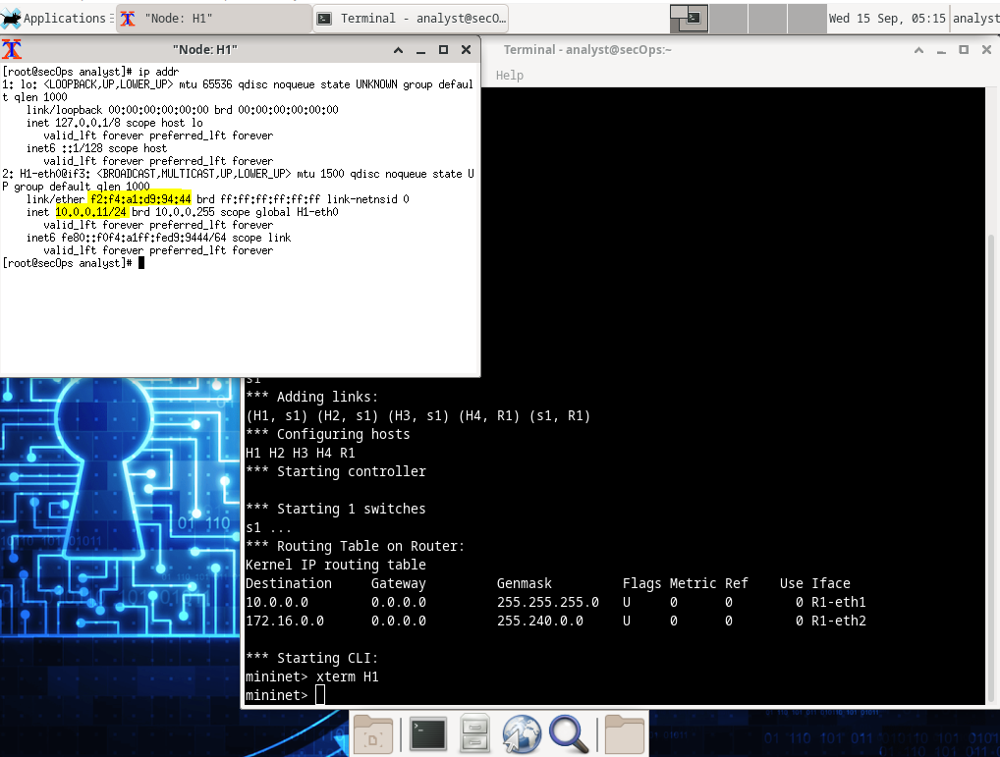
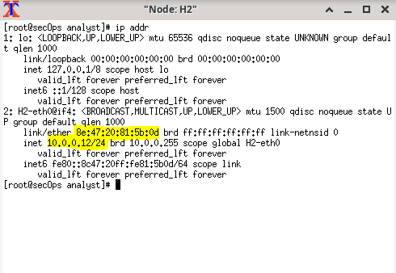
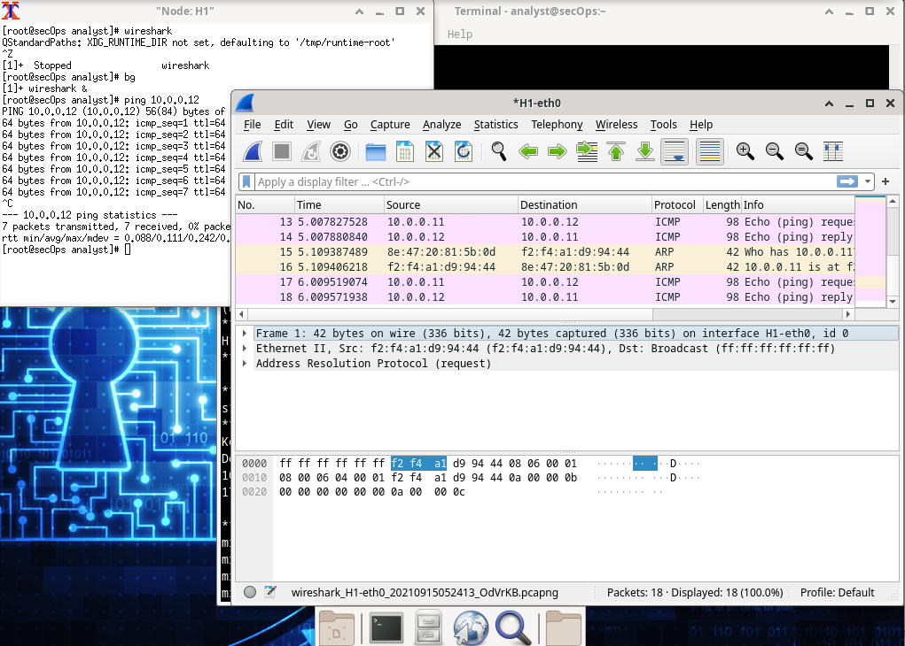
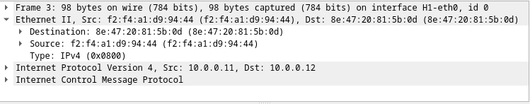
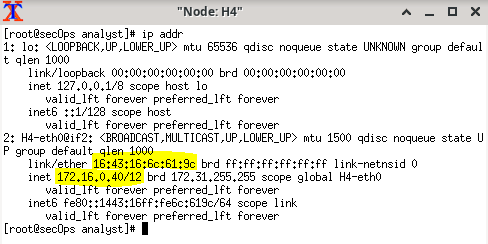
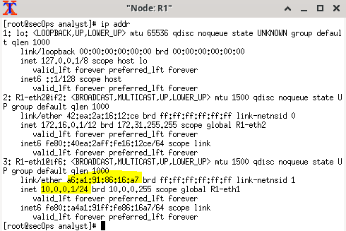
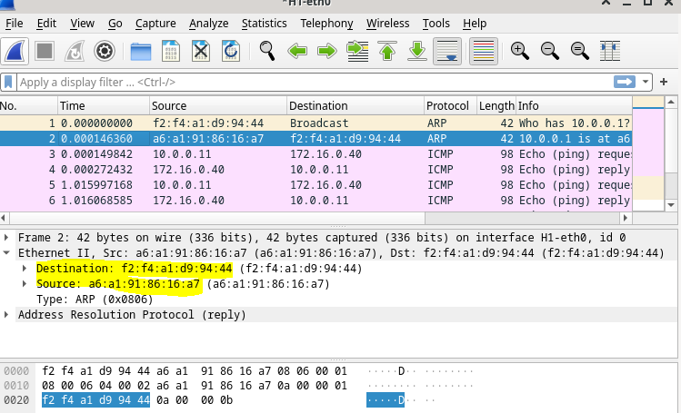

# Introducción a Wireshark

Wireshark es un analizador de protocolos de software o una aplicación “husmeadora de paquetes” que se utiliza para solución de problemas de red, análisis, desarrollo de protocolos y software y educación. Mientras los flujos de datos transitan por la red, el husmeador “captura” cada unidad de datos del protocolo (Protocol Data Unit, PDU) y puede decodificar y analizar su contenido de acuerdo a la RFC correcta o a otras especificaciones.

Wireshark es una herramienta útil para cualquier persona que trabaje con redes y necesite capacidades de análisis de datos y solución de problemas. Utilizarán Wireshark para capturar paquetes de datos ICMP.

Dentro de la VM de CyberOps tenemos un lab de prueba:

Registramos la MAC y la IPv4 para la H1

Y hacemos lo mismo para H2

Para iniciar wireshark nos vamos a un nodo, en este caso H1 y usamos `wireshark &` para ejecutarlo en el background.

<pre>wireshark &</pre>

Haga clic en Aceptar para continuar.

Si hacemos un PING desde nuestro nodo H1 podemos capturar el trafico usando wireshark.

Si es necesario, hagan clic en las primeras tramas de PDU de la solicitud ICMP en la sección superior de Wireshark. Observen que la columna Source (Origen) tiene la dirección IP de H1, y que la columna Destination (Destino) tiene la dirección IP de H2.

Con esta trama de PDU aún seleccionada en la sección superior, navegue hasta la sección media. Haga clic en la flecha que se encuentra a la izquierda de la fila Ethernet II para ver las direcciones MAC de origen y de destino.

Podemos ver que la MAC y la IP es la misma que nuestro nodo H2, que es donde hemos hecho el ping.

Haremos ping afuera de nuestra red usando el nodo H4 y el Router.

Podemos ver que pasa por el router.

Para hacer limpieza de todo lo que hemos ejecutdo usamos esto:

<pre>sudo mn -c</pre>