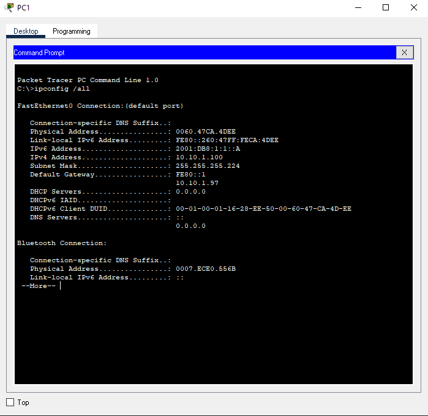
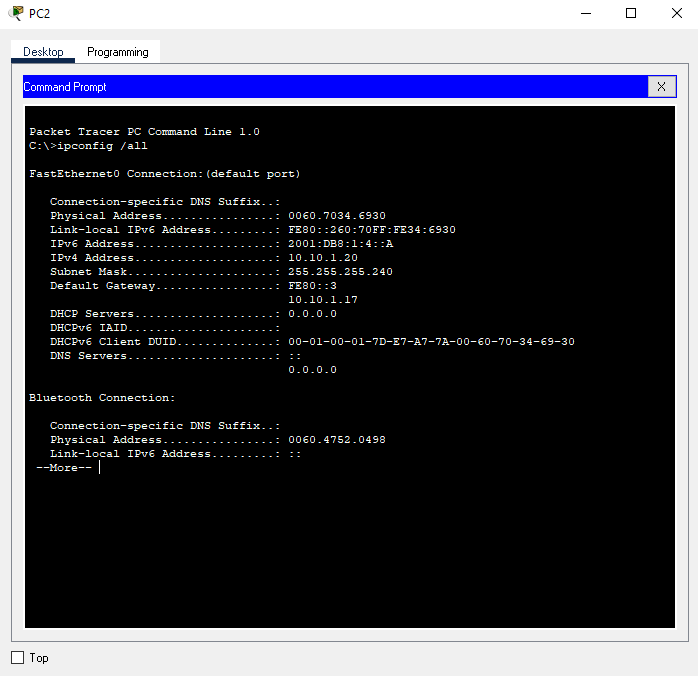

# Packet Tracer: Verifique el direccionamiento IPv4 e IPv6

La técnica dual-stack permite que IPv4 e IPv6 coexistan en la misma red. En esta actividad, investigará una implementación de doble pila ,incluida la documentación de la configuración IPv4 e IPv6 para dispositivos finales, probar la conectividad para IPv4 e IPv6 mediante ping y trazar la ruta de acceso de extremo a extremo para IPv4e IPv6. Complete la documentación de la tabla de direcciones.

- PC1 <ul>
        <li>IPv4: ``10.10.1.100``</li>
        <li>Mask: ``225.225.225.224``</li>
        <li>Mask: ``10.10.1.97``</li>
    </ul>

- PC2 <ul>
        <li>IPv4: ``10.10.1.20``</li>
        <li>Mask: ``225.225.225.240``</li>
        <li>Mask: ``10.10.1.17``</li>
    </ul>

