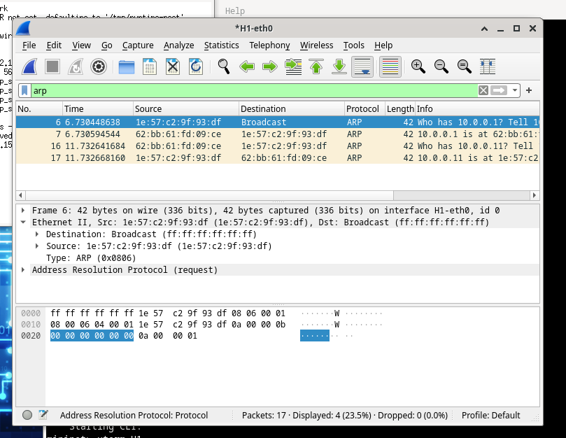
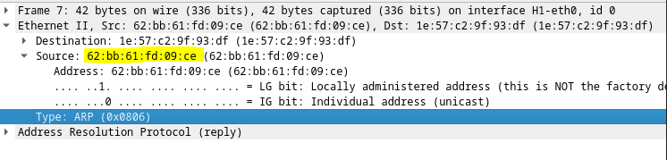
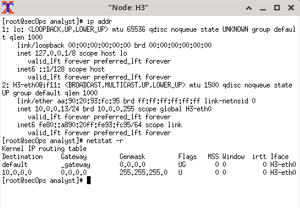
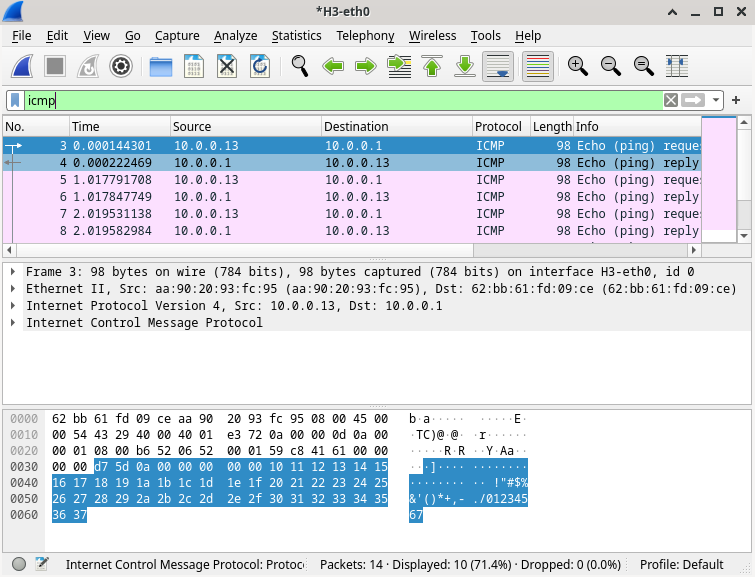

# Uso de Wireshark para examinar las tramas de Ethernet 

Cuando los protocolos de capa superior se comunican entre sí, los datos fluyen por las capas de interconexión de sistemas abiertos (OSI) y se encapsulan en una trama de capa 2. La composición de la trama depende del tipo de acceso al medio. Por ejemplo, si los protocolos de capa superior son TCP e IP, y el acceso a los medios es Ethernet, el encapsulamiento de tramas de capa 2 es Ethernet II. Esto es típico para un entorno LAN.

Al aprender sobre los conceptos de la capa 2, es útil analizar la información del encabezado de la trama. En la primera parte de esta práctica de laboratorio, revisará los campos que contiene una trama de Ethernet II. En la parte 2, utilizará Wireshark para capturar y analizar campos de encabezado de tramas de Ethernet II de tráfico local y remoto.

Si filtramos por ARP podemo ver que todos los hosts de la LAN reciben esta trama de difusión. El host que tiene la dirección IP 192.168.1.1 (gateway predeterminado) envía una respuesta de unidifusión al origen (equipo host). Esta respuesta contiene la dirección MAC de la NIC del gateway predeterminado.

La difusión de ARP se utiliza para solicitar la dirección MAC del host con la dirección IP incluida en el ARP.

Los primeros 3 octetos de la dirección MAC indican el OUI.

En este caso sería este: 

y `62:bb:61` marcaria el fabricante.

Nuestro nodo H3 tiene lo siguente:

La ventana principal de Wireshark se divide en tres secciones: el panel Packet List en la parte superior, el panel Packet Details (Detalles del paquete) en la parte central y el panel Packet Bytes (Bytes del paquete) en la parte inferior. Si seleccionó la interfaz correcta para la captura de paquetes en el paso 3, Wireshark debería mostrar la información de ICMP en el panel Packet List (Lista de paquetes), de manera similar a la del siguiente ejemplo.

En el panel Packet List (Lista de paquetes) de la parte superior, haga clic en la primera trama de la lista. Debería ver el texto Echo (ping) request (Solicitud de eco ``[ping]``) debajo del encabezado Info (Información). Con esta acción, se debe resaltar la línea con color azul.

En la segunda línea del panel Packet Details (Detalles del paquete), se muestra que es una trama de Ethernet II. También se muestran las direcciones MAC de origen y de destino.

En las últimas dos líneas de la parte central, se proporciona información sobre el campo de datos de la trama. Observe que los datos contienen información sobre las direcciones IPv4 de origen y de destino.

Cuando se hace ping a un host remoto, el origen utiliza la dirección MAC del gateway predeterminado para el destino de la trama. El gateway predeterminado recibe el paquete, la quita la información de trama de capa 2 y crea un nuevo encabezado de trama con la dirección MAC del siguiente salto. Este proceso continúa de router a router hasta que el paquete llega a la dirección IP de destino.

El campo de preámbulo contiene siete octetos de secuencias alternantes de “1010” y un octeto que indica el comienzo de una trama: 10101011.