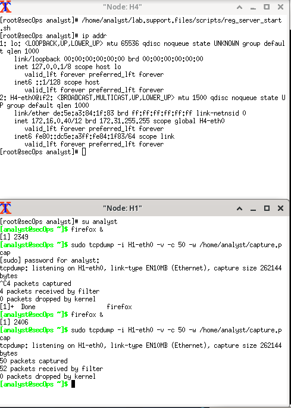
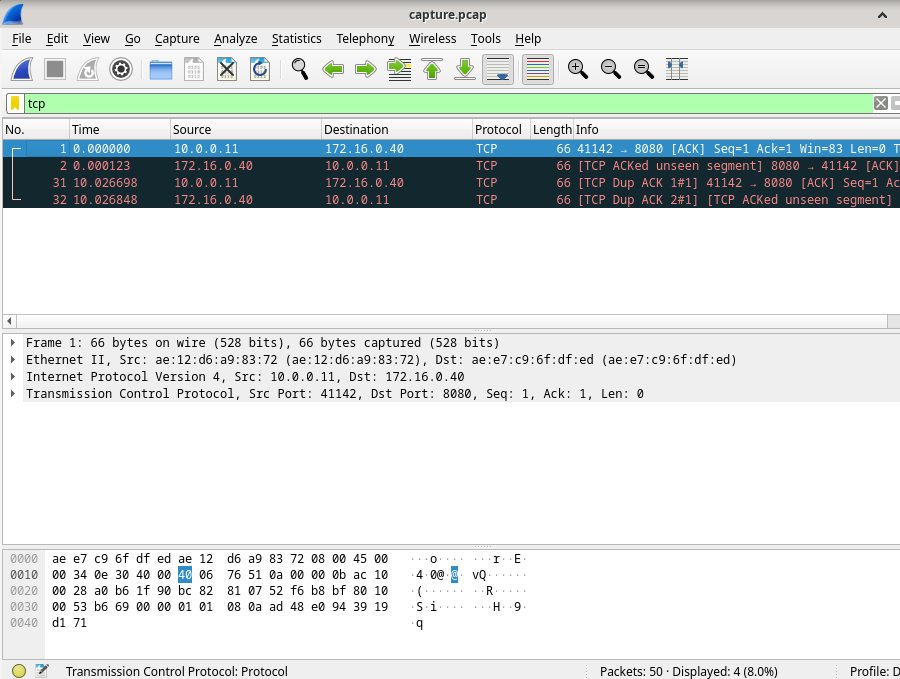
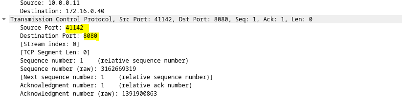
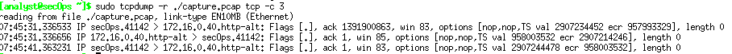

# Uso de Wireshark para observar el protocolo de enlace TCP de 3 vías Handshake

En este laboratorio, utilizará Wireshark para capturar y examinar los paquetes generados entre el navegador de PC utilizando el protocolo de transferencia de hipertexto (HTTP) y un servidor web, como www.google.com. Cuando una aplicación, como HTTP o el protocolo de transferencia de archivos (FTP), se inicia en un host, TCP utiliza la negociación en tres pasos para establecer una sesión de TCP confiable entre los dos hosts. Por ejemplo, cuando una PC utiliza un navegador web para navegar por Internet, se inicia una negociación en tres pasos y se establece una sesión entre el host de la PC y el servidor web. Una PC puede tener varias sesiones de TCP activas simultáneas con varios sitios web.



Inicie la VM CyberOps. Inicie sesión con el nombre de usuario analyst y la contraseña cyberops.
Inicie Mininet.
[analyst@secOps ~]$ sudo lab.support.files/scripts/cyberops_topo.py
Inicien los hosts H1 y H4 en Mininet.

````sh
*** Starting CLI:
mininet> xterm H1
mininet> xterm H4
````
Inicie el servidor web en H4.
[root@secOps analyst]# /home/analyst/lab.support.files/scripts/reg_server_start.sh
Por motivos de seguridad, no está admitido el uso de Firefox para la cuenta raíz. En el host H1, utilice el comando "switch user" de cambiar del usuario raíz a la cuenta de usuario del analista: 

<pre>[root@secOps analyst]# su analista</pre>
Inicie el navegador web en H1. Esto demorará unos instantes.


<pre>[analyst@secOps ~]$ firefox &</pre>
Después de que se abra la ventana de Firefox, inicien una sesión de tcpdump en el terminal Nodo: H1 y envíe la salida a un archivo de nombre capture.pcap. Con la opción ``-v`` pueden ver el progreso. Esta captura se detendrá después de capturar 50 paquetes, porque está configurada con la opción -c 50.


<pre>[analyst@secOps ~]$ sudo tcpdump -i H1-eth0 -v -c 50 -w /home/analyst/capture.pcap</pre>

Después de que se inicie tcpdump, diríjase rápidamente a 172.16.0.40 en el navegador web Firefox.

Podemos ver el trafico que nos interesa usando el filtro `tcp`.



Podemos ver los puertos de salida y de entrada.



Tambien podemos leer los archivos `.pcap` usando tcpdump:

<pre>tcpdump -r /home/analyst/capture.pcap tcp -c 3</pre>



En este caso `-c` son tres lineas `tcp` es la palabra por la que filtrar

Wireshark se utiliza generalmente para fines de seguridad, en el análisis a posteriori del tráfico normal o después de un ataque a la red. Es posible que deban capturarse nuevos protocolos o servicios para determinar cuáles puertos se utilizan.