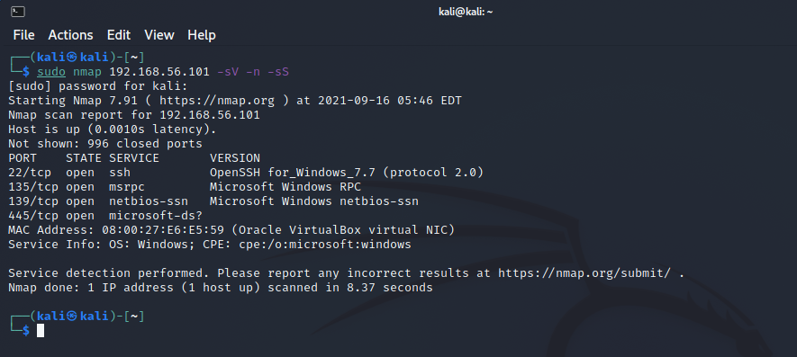

# Gestión remota de servicios usando escritorio remoto

- Tenemos dos maquinas una es Kali Linux y otra es Windows 10.

- Las dos estan en la misma red.

``Windows tiene esta IP.``

``Kali tiene esta IP.``

Windows tiene por defecto el firewall activado para redes publicas, privadas y dominios.

Tenemos que desactivarlo usando este commando de PowerShell:

<pre>Set-NetFirewallProfile -Profile Domain,Public,Private -Enabled False</pre>

`Estamos desactivando el firewall a todos los niveles publico, privado y dominio`

O tambien navegando hasta Windows Security por la GUI.

Ahora que se pueden comunicar entre ellos con PING, lo siguiente es escanear los puertos abiertos que tiene Windows desde Kali. Para esto usamos el siguiente commando:

Si el FireWall de Windows tiene el puerto 22 cerrado deberemos de abrirlo.(con fines de seguir el ejercicio, pero claramente no encontraremos asi de facil abierto el puerto 22)

<pre>New-NetFirewallRule -DisplayName 'SSh' -Profile 'Private,Public,Domain' -Direction Inbound -Action Allow -Protocol TCP -LocalPort 22
</pre>

En Kali ejecutamos este commando para ver que puertos podemos exploatar.

<pre>sudo nmap 192.168.56.101 -sV -n -sS</pre>

- Podemos ver que Windows en verdad tiene el puerto 22 abierto.

Si no disponemos de credenciales podemos usar nmap para encontrar el usuario y password usando este commando:

<pre>nmap 192.168.56.101 -p 22 --script ssh-brute</pre>

Esto tardará mucho si la contraseña es fuerte ya que usa la base de datos interna de nmap para hacer el match con diferentes contraseñas y usuarios.

``Pero podemos usar una lista de usuarios y contraseñas`` si sabemos algo más sobre el usuario, ej.(cumpleaños, nombre, coche, hobbies, personalidad etc)

<pre>nmap 192.168.56.101 -p 22 --script ssh-brute --script-args userdb=user.txt,passdb=psw.txt</pre>

Aqui podemos ver que ha encontrado un match!(``de antemano ya sabia la contraseña``)

Ahora que sabemos las credenciales podemos entrar por RDP usando ``Remmina``.
(quizas el pc windows tiene Remote Desktop quitado, en este caso por seguir con la practica usamos estos commandos en el pc Windows para activarlo)

<pre>reg add "HKLM\SYSTEM\CurrentControlSet\Control\Terminal Server" /v fDenyTSConnections /t REG_DWORD /d 0 /f
</pre>

<pre>netsh advfirewall firewall set rule group="remote desktop" new enable=yes</pre>

Y podemos detener servicios y hacer lo que queramos.

Obviamente podemos iniciar una sesión en ssh tambien usando el puerto 22:

<pre>ssh ieuser@192.168.56.101</pre>

Y una vez dentro iniciar PowerShell:

Pero si el puerto 22 no estaba disponibre en primer lugar, quizas estaba el de WinRm: 
- `HTTP – Port 5985`
- `HTTPS – Port 5986`

Asi podemos usar PowerShell desde otro equipo Windows para acceder.
Se hace de la forma siguiente:

<pre>Invoke-Command -ComputerName COMPUTER -ScriptBlock { COMMAND } -credential USERNAME</pre>

O iniciando una sesion:

<pre>Enter-PSSession -ComputerName COMPUTER -Credential USER</pre>

Y ya estamos dentro.

Para seguir el ejercicio quizas sea necesario activar WinRm, en este caso usen los siguientes commandos en las dos maquinas Windows:

<pre>
Enable-PSRemoting -Force
Set-Item wsman:\localhost\client\trustedhosts *
Restart-Service WinRM
</pre>

Hagan la prueba:

<pre>Test-WsMan COMPUTER</pre>

Adicionalmente podemos usar programas para cambiar/restaurar/romper contraseñas:
- ``John the Ripper`` 
- ``hashcat`` 
- ``nmap``
- ``chntpw`` (usaremos esta)

## Hay que descargar la herramienta chntpw: 

http://pogostick.net/~pnh/ntpasswd/cd140201.zip

- Despues se monta en un CD USB o directamente en la unidad optica de la VM

- Reiniciamos la maquina y en la BIOS elegimos ejecutar desde el CD:

Despues es un proceso sencillo de seguir ya que como podemos ver tenemos acceso al disco duro y a la ruta `C:\Windows\System32\config`, que es donde estan los ficheros SAM (Security Account Manager)

despues de limpiar la contraseña se podrá iniciar sesion sin problema y se puede cambiar la contraseña.

- Obviamente tambien si se logra entrar por ssh se puede usar este commando en PowerShell para generar una nueva password para el user que queremos:

<pre>Set-ADAccountPassword -Identity $user -Reset -NewPassword (ConvertTo-SecureString -AsPlainText "$newPass" -Force)</pre>

### Como conclusión es importante mantener todos los puertos que no sean necesarios cerrados y crear contraseñas muy solidas. En el caso de tener que tener puertos abiertos para usar RDP, SSH, WinRM despues de hacer nuestro trabajo es crucial cerrar dichos puertos y parar los servicios. 