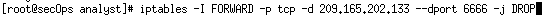

# Práctica de laboratorio: Reglas de Snort y de firewalls

En una red de producción segura, las alertas de red son generadas por diversos tipos de dispositivos como dispositivos de seguridad, firewalls, dispositivos IPS, routers, switches y servidores, entre otros. El problema es que no todas las alertas se crean de la misma manera. Por ejemplo: las alertas generadas por un servidor las generadas por un firewall serán diferentes y tendrán distintos contenidos y formatos. 

- Parte 1: Preparar el entorno virtual

    Ejecutar Oracle VirtualBox y cambie la CyberOps Workstation a modo puente(Bridged), si es necesario Seleccionen Machine > Settings > Network (Máquina > Configuración > Red). En Conectado a, seleccione Adaptador de puente (o, si utiliza wifi con un proxy, puede que necesite el adaptador NAT), y haga clic en Aceptar.

    <pre>$ sudo ./lab.support.files/scripts/configure_as_dhcp.sh</pre>

    

    Utilicen el comando ifconfig para verificar que la VM CyberOps Workstation ahora tenga una dirección IP en sus redes locales. También pueden probar la conectividad a un servidor web público si emiten un ping a www.cisco.com. Presionen Ctrl+C para detener los pings.

    

- Parte 2: El firewall y los archivos de registro de IDS

    A menudo se implementan firewalls y Sistemas de detección de intrusiones (Intrusion Detection Systems, ``IDS``) para automatizar parcialmente la tarea del monitoreo de tráfico. Tanto los firewalls como los IDS comparan el tráfico entrante con reglas administrativas. Los firewalls suelen comparar el encabezado de un paquete con un conjunto de reglas mientras que los IDS utilizan la carga útil del paquete para compararla con los conjuntos de reglas. Como los firewalls y los IDS aplican las reglas predefinidas a diferentes porciones del paquete IP, las reglas de los IDS y de los firewalls tienen estructuras diferentes.

    Un diseño de firewall común es descartar paquetes de manera predeterminada y especificar manualmente el tráfico que se debe permitir. Conocido como descartar por defecto, este diseño tiene la ventaja de proteger la red de protocolos y ataques desconocidos. Como parte de este diseño, es común registrar los eventos de los paquetes descartados porque se trata de paquetes no permitidos explícitamente y, por lo tanto, infringen las políticas de la organización. Tales eventos deben registrarse para próximos análisis.

    - En la VM CyberOps Workstation VM, ejecuten el script para iniciar mininet.

    <pre>$ sudo ./lab.support.files/scripts/cyberops_extended_topo_no_fw.py</pre>

    

    - En el cursor de mininet, abran un shell en R1 con el siguiente comando:

    <pre>xterm R1</pre>

    El shell de R1 se abre en una ventana del terminal con texto negro y fondo blanco. ¿Qué usuario ha iniciado sesión en ese shell? ¿Qué nos lo indica?

    `Es root, por el hash #`

    - En el shell de R1, inicien el IDS basado en Linux: Snort.

    <pre>$ ./lab.support.files/scripts/start_snort.sh </pre>

    

    - En el prompt de mininet de la máquina virtual CyberOps Workstation, abra shells para los hosts H5 y H10.

    - H10 simulará ser un servidor de Internet que aloja malware. En H10, ejecute el script mal_server_start.sh para iniciar el servidor.

    - En H10, utilicen netstat con las opciones -tunpa para verificar que el servidor web se esté ejecutando. Cuando se utiliza como se indica arriba, netstat genera una lista de todos los puertos asignados a servicios en este momento:

    

    Tal como se ve en el resultado anterior, el servidor web ligero nginx se está ejecutando y está escuchando conexiones en el puerto TCP 6666.

    - Se está ejecutando una instancia de Snort en la ventana del terminal de R1. Para introducir más comandos en R1, abra otro terminal de R1; para ello, vuelva a introducir xterm R1 en la ventana del terminal de la máquina virtual CyberOps Workstation. También es posible que quieran organizar las ventanas del terminal para poder ver e interactuar con cada dispositivo.

    - En la nueva ficha del terminal de R1, ejecuten el comando tail con la opción -f para monitorear el archivo /var/log/snort/alert en tiempo real. Es en este archivo que se configura Snort para registrar alertas.

    <pre>$ tail -f /var/log/snort/alert</pre>

    Como todavía no se registró ninguna alerta, el archivo de registro debería estar vacío. Sin embargo, si ya han realizado esta práctica de laboratorio, es posible que aparezcan entradas de alertas extrañas. En cualquier caso, no verán ningún cursor después de escribir este comando. En esta ventana se mostrarán las alertas a medida que tengan lugar.

    

    - En H5, utilicen el comando wget para descargar un archivo de nombre W32.Nimda.Amm.exe. Diseñada para descargar contenido a través de HTTP, wget es una excelente herramienta para descargar archivos desde servidores web directamente desde la línea de comandos.

    <pre>$ wget 209.165.202.133:6666/W32.Nimda.Amm.exe</pre>

    

    Como se puede ver el archivo se descargo completamente y el IDS nos indica que es un malware.

    - En H5, utilicen el comando tcpdump para capturar el evento y volver a descargar el archivo malicioso y así poder capturar la transacción. Emitan el siguiente comando para iniciar la captura de paquetes:

    <pre>$ tcpdump –i H5-eth0 –w nimda.download.pcap &</pre>

    

    - Ahora que tcpdump está capturando paquetes, vuelvan a descargar el malware. En H5, vuelvan a ejecutar el comando o utilicen la flecha hacia arriba para recuperarlo del centro del historial de comandos.

    - Lleve tcpdump al primer plano con el comando fg para detener la captura. Como tcpdump era el único proceso que se había enviado a segundo plano, no es necesario especificar el PID. Detengan el proceso de tcpdump con Ctrl+C. El proceso de tcpdump se detiene y exhibe una resumen de la captura. La cantidad de paquetes puede diferir en sus capturas.

    - En H5, utilicen el comando ls para verificar que el archivo pcap realmente se haya guardado en el disco y que su tamaño sea mayor que cero:

    

    Los archivos PCAP contienen los paquetes relacionados con el tráfico por la NIC de captura. De esta manera, la PCAP es muy útil para volver a desandar eventos de red, tales como la comunicación a puntos extremos maliciosos. Herramientas, tales como Wireshark, pueden utilizarse para facilitar el análisis de PCAP.

- Afinar reglas de firewall en función de alertas de un IDS

    - En la VM CyberOps Workstation, inicien una tercera ventana del terminal de R1.

    - En la nueva ventana del terminal de R1, utilicen el comando iptables para generar una lista de las cadenas y sus reglas en uso:

    

    - Las conexiones al servidor malicioso generan paquetes que deben atravesar el firewall iptables en R1. Los paquetes que atraviesan el firewall son manejados por la regla de FORWARD y, por lo tanto, esa es la cadena que recibirá la regla de bloqueo. Para impedir que las computadoras de los usuarios se conecten al servidor malicioso identificado en el Paso 1, agreguen la siguiente regla a la cadena FORWARD en R1: 

    <pre>iptables -I FORWARD -p tcp -d 209.165.202.133 --dport 6666 -j DROP</pre>

    

    - En H5, traten de descargar el archivo nuevamente:

    

    El firewall está bloqueando las conexiones al servidor de alojamiento de malware.

    - Diríjanse al terminal que se utilizó para iniciar Mininet. Introduzca quit en la ventana del terminal principal de la VM CyberOps para finalizar Mininet.

    - Después de salir de Mininet, limpie los procesos que inició Mininet. Introduzcan la contraseña cyberops cuando el sistema se los solicite.